# DSO202 Assignment 1 — Three Tier Task Tracker on Kubernetes

This report covers the full setup of the three tier Task Tracker application on the kind cluster, task by task, along with the evidence collected for each part and the issues that came up along the way.

---

## Repository Structure

```
assignment/
├── namespace.yaml
├── configmap.yaml
├── secret.yaml
├── quota.yaml
├── rbac.yaml
├── database/
│   ├── pvc.yaml
│   ├── deployment.yaml
│   └── service.yaml
├── backend/
│   ├── deployment.yaml
│   └── service.yaml
├── frontend/
│   ├── deployment.yaml
│   ├── service.yaml
│   └── nginx-proxy-configmap.yaml
├── evidence/
└── README.md
```

---

## Task 1: Namespace and Architecture Note

The namespace `dso202-assignment-01` was created first, before any other manifest, since every other object in this assignment depends on it.

**Evidence**

Cluster nodes ready before starting:

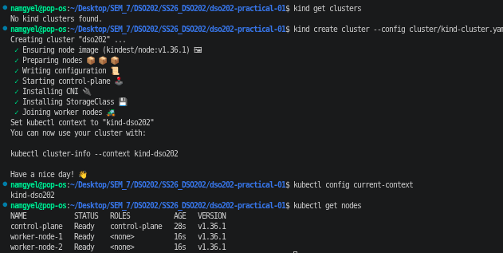

Namespace created:

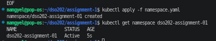

Context set to use this namespace by default:

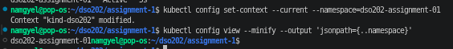

### Architecture Note (revised)
 
This assignment deploys a three tier Task Tracker into the namespace `dso202-assignment-01`, on top of the existing three node kind cluster (`dso202`) built in Practical 1. Working through this task by task made it much clearer how the different Kubernetes objects actually map onto real application tiers, rather than just being separate topics from the lecture.
 
**Database tier.** A single replica Deployment runs the provided Postgres based image `sarojsanyasi/dso202-db`. When this Deployment is applied, kube-apiserver stores the request, kube-scheduler picks one of the two worker nodes to place the Pod on, and kubelet on that node pulls the image and starts the container. The database's data folder is backed by a PersistentVolumeClaim so the data survives even if the Pod is deleted and recreated, which is something that became very obvious later in Task 7c when the backend Pod was deleted and the task data was still there afterward. This tier is exposed only through a headless Service (`clusterIP: None`), since there is only ever one database instance running and the backend should connect straight to that one Pod's address instead of going through a load balanced virtual IP. This made more sense after seeing that a normal ClusterIP Service would load balance between replicas, which does not really apply here since there is only ever one database Pod.
 
**Backend tier.** A Deployment runs the provided image `sarojsanyasi/dso202-backend`. It reads its database connection details from the ConfigMap and Secret created in Task 2. It is exposed with a ClusterIP Service, which means it can be reached by name from other Pods in the namespace but is never reachable from outside the cluster, matching the assignment's requirement that the backend should never be exposed directly. Seeing this constraint in practice, rather than just reading it in the brief, made the difference between ClusterIP and NodePort feel a lot more concrete than it did in Practical 1.
 
**Frontend tier.** A Deployment runs the provided image `sarojsanyasi/dso202-frontend`. It reads the backend's address from the ConfigMap. It is exposed through a NodePort Service, using the port already mapped in the kind cluster config from Practical 1, so the page can be opened directly in a browser at `http://localhost:30080`. This is the only tier allowed to be reached from outside the cluster, which lines up with it being the only tier a real user is ever supposed to interact with directly.
 
**Control plane role, common to all three tiers.** kube-apiserver validates and stores every manifest applied. kube-scheduler decides which node each Pod lands on, working within the limits set later by the ResourceQuota in Task 6. kubelet on the chosen node pulls the image and keeps the container running. kube-proxy on every node sets up the rules that let a Service route traffic to the right Pod no matter which node that Pod is actually running on. Thinking through this before writing any manifest, as the assignment asked, made the later tasks feel less like copying a pattern from Practical 1 and more like actually deciding which object fits which job.
 
---


## Task 2: Configuration and Secrets

One ConfigMap (`app-config`) holds all the non sensitive values needed by the three tiers: `DB_HOST`, `DB_PORT`, `DB_NAME`, `APP_PORT`, `CORS_ORIGIN`, `POSTGRES_DB`, and `BACKEND_URL`.

One Secret (`app-secret`) holds the credential values: `DB_USER`, `DB_PASSWORD`, `POSTGRES_USER`, `POSTGRES_PASSWORD`. The values for `DB_USER`/`POSTGRES_USER` are identical, and the same goes for `DB_PASSWORD`/`POSTGRES_PASSWORD`, since the backend and the official Postgres image use different variable names for the exact same credentials.

**Evidence**

Both objects created:

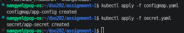

ConfigMap contents:

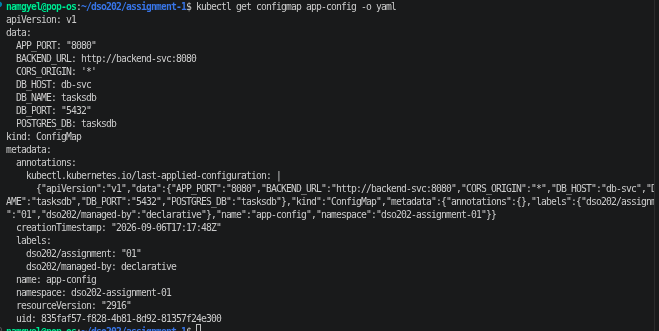

Secret shown in base64 form:

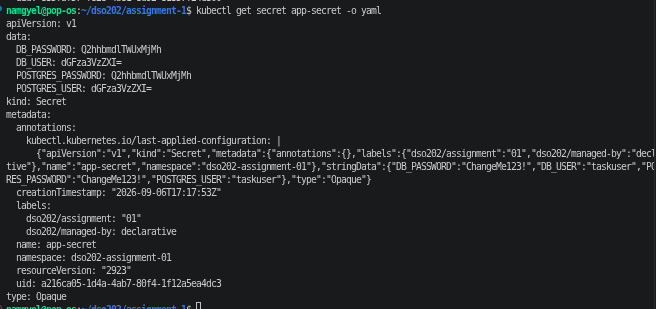

### Secrets caveat

Kubernetes Secrets are base64 encoded, not encrypted, by default. Anyone with permission to read Secret objects in this namespace can decode the values easily, for example:

```
kubectl get secret app-secret -o jsonpath='{.data.DB_PASSWORD}' | base64 -d
```

Storing the credentials as a Secret instead of a ConfigMap follows the general convention that credentials belong in a Secret object, but it does not provide real protection on its own. A production setup would need extra measures such as encryption at rest for etcd, or an external secrets manager, which is outside the scope of this assignment (Unit I only).

---

## Task 3: Database Tier

A PersistentVolumeClaim (`db-pvc`) requests 1Gi of storage using kind's default storage class. A single replica Deployment mounts this PVC at the database's data path and reads the `POSTGRES_*` keys from the ConfigMap and Secret. A headless Service (`db-svc`) exposes the database inside the namespace only.

### Known issue: image only built for arm64

While pulling the database image, the Pod got stuck in `ImagePullBackOff`. Checking the error message with `kubectl describe pod` showed:

```
no match for platform in manifest: not found
```

Running `docker manifest inspect sarojsanyasi/dso202-db:1.0` confirmed the image only has an arm64 build, while this machine is amd64. This was reported to the tutor by email, since it likely affects every student on an x86 machine, and the same problem showed up for the backend and frontend images too.

As a workaround, each image was pulled using `--platform linux/arm64` and QEMU emulation, then loaded directly into the kind nodes using `kind load docker-image`, instead of relying on a normal registry pull. Each Deployment therefore uses `imagePullPolicy: Never` instead of the usual `IfNotPresent`, since the image is already sitting on the node rather than being pulled fresh. This should be switched back once the tutor publishes a fixed image.

**Evidence**

QEMU emulation registered:

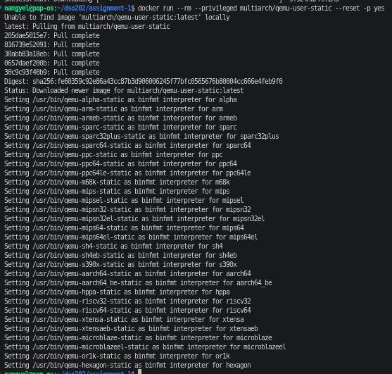

Database image loaded into the kind nodes:

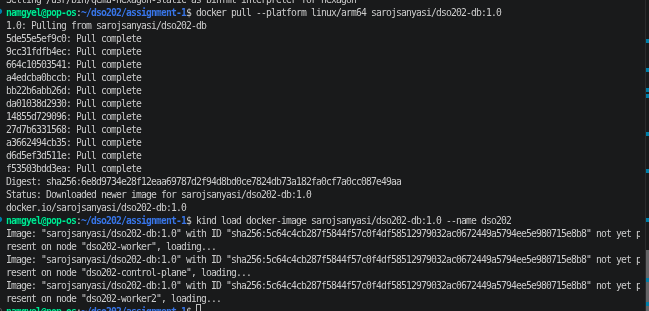

Database Pod running:

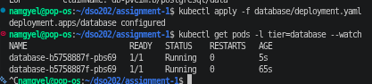

PVC bound:

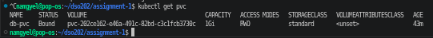

Database logs showing Postgres started up correctly:

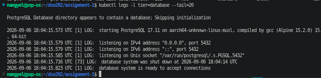

Headless Service created (note CLUSTER-IP shows None):

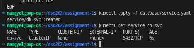

DNS resolving straight to the Pod's own IP address, confirming it really is headless:

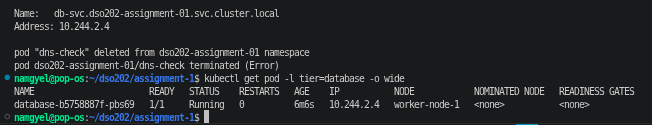

---

## Task 4: Backend Tier

A Deployment runs the backend image and reads the `DB_*` keys from the ConfigMap and Secret, with `DB_HOST` pointing at `db-svc`. A ClusterIP Service (`backend-svc`) exposes it inside the namespace only, and it is never reachable from outside the cluster.

The same arm64 workaround from Task 3 was needed here as well, loading the backend image into the kind nodes directly.

**Evidence**

Backend image loaded into kind:

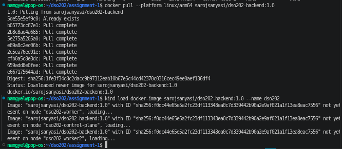

Backend Pod running:

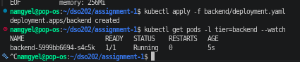

Backend logs showing a successful connection to the database:

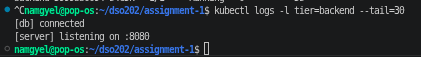

ClusterIP Service created:

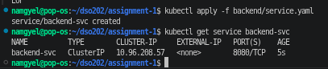

Backend responding on `/api/status` through a port forward:

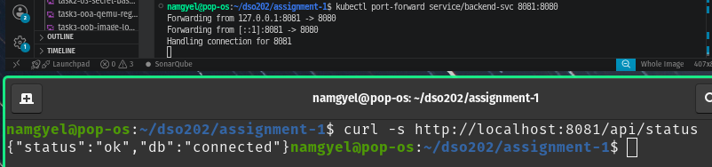

---

## Task 5: Frontend Tier

A Deployment runs the frontend image and reads `BACKEND_URL` from the ConfigMap. A NodePort Service (`frontend-svc`) exposes it on port 30080, matching the port already mapped in the kind cluster config, so it can be opened directly in a browser.

**Evidence**

Frontend image loaded into kind:

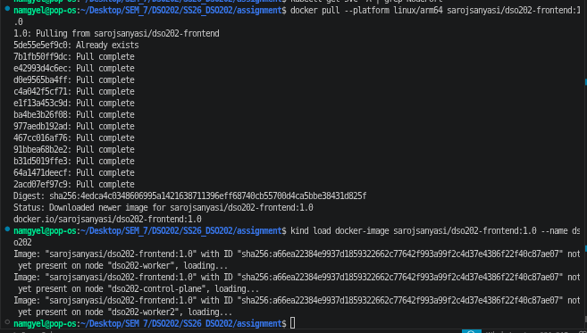

Frontend Pod running:

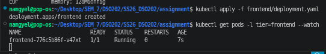

Frontend logs:

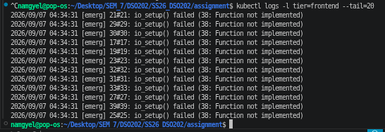

NodePort Service created:

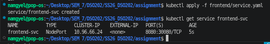

### Known issue and fix: frontend could not reach the backend from the browser

The first time the page was opened at `http://localhost:30080`, it failed with a network error when trying to load tasks:


**What was going on.** The frontend's JavaScript runs a `fetch()` call straight from the browser to `BACKEND_URL`. That value was originally set to `http://backend-svc:8080`, which is the correct address inside the cluster, but a browser sitting on the host machine cannot resolve `backend-svc` at all, since that name only exists in the cluster's own internal DNS. Exposing the backend directly through a NodePort was not an option either, since the assignment does not allow the backend to be reachable from outside the cluster.

**How it was fixed.** A small reverse proxy rule was added to the frontend's nginx config, so the browser talks to the frontend's own address (`/api/...`) and nginx, running inside the Pod, forwards that request to `backend-svc` on the inside. This was done by creating a second ConfigMap (`frontend-nginx-conf`) holding a corrected `nginx.conf` with an added `location /api/` proxy rule, plus a corrected copy of the entrypoint script, since the original script replaced an empty `BACKEND_URL` value with a default of `http://localhost:8080`, which on this machine pointed straight at an unrelated Jenkins server already running on that port. Both files were mounted into the frontend container using `subPath`, without changing the original image at all. `BACKEND_URL` in the main ConfigMap was then set to an empty string, so the frontend calls a relative path that nginx picks up locally.

After this change, the page loaded and worked correctly end to end.

**Evidence**

Frontend working correctly after the fix:

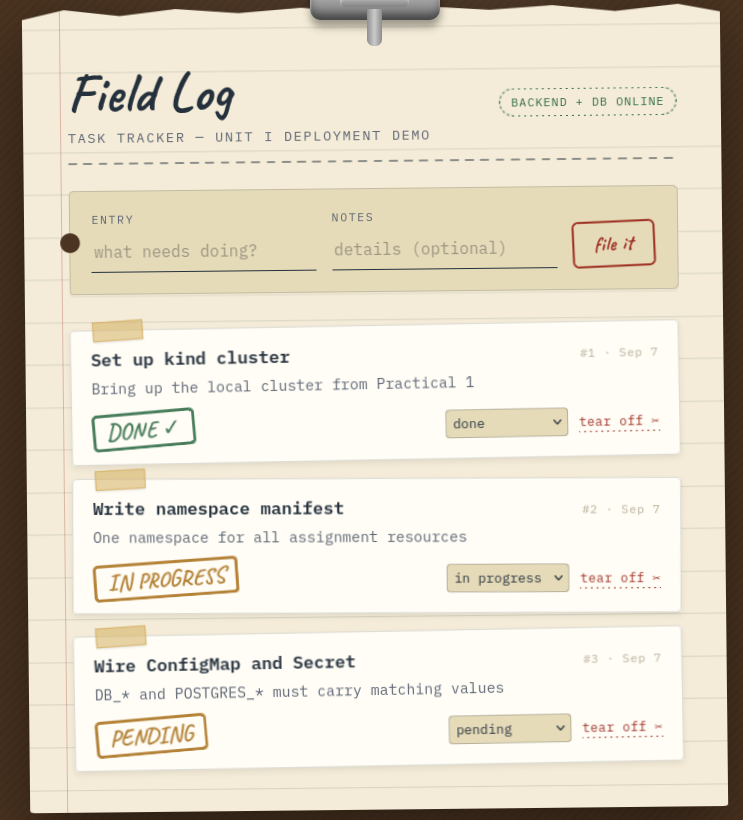

Network tab showing the request now succeeding:

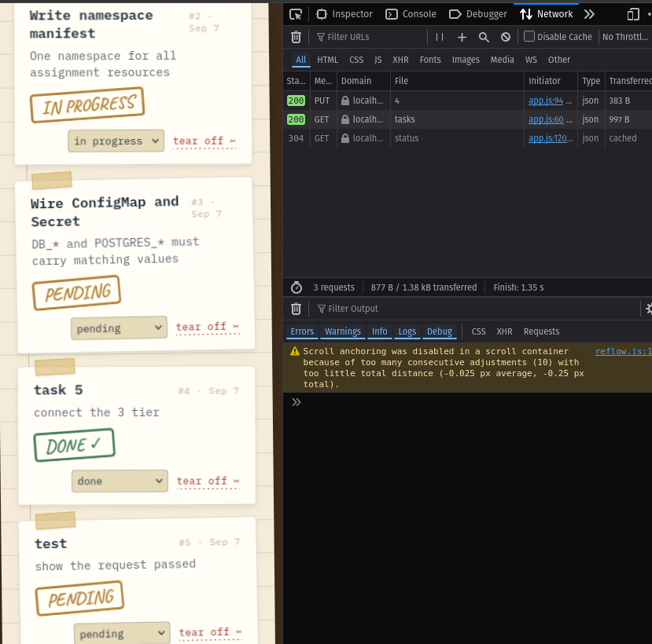

config.js showing the corrected empty BACKEND_URL value:

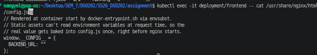

nginx.conf showing the added proxy rule:

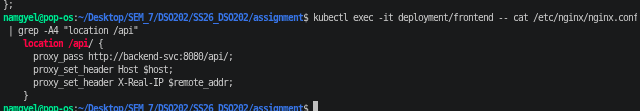

Both ConfigMaps present in the namespace:

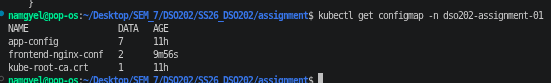

---

## Task 6: Namespace Resource Governance

The three Deployments together request 250m CPU and 320Mi memory, with limits adding up to 1 CPU and 896Mi memory. The ResourceQuota (`quota.yaml`) was sized with headroom on top of these numbers rather than picking round numbers at random:

- `requests.cpu: 1` and `requests.memory: 1Gi`, roughly three to four times the current total, leaving room for rolling updates and short lived debug Pods without allowing unlimited growth.
- `limits.cpu: 2` and `limits.memory: 2Gi`, roughly double the current total, since limits are generally allowed more overcommitment than requests.
- `pods: 10`, covering the three running replicas plus space for temporary Pods used during testing.
- `count/services: 5`, covering the three Services actually created plus a little room to spare.
- `count/configmaps: 10` and `count/secrets: 10`, covering the ConfigMaps and Secret actually created plus the automatic `kube-root-ca.crt` ConfigMap that every namespace gets by default.

The LimitRange defaults (`default`, `defaultRequest`, `min`, `max`) match the values already used in the frontend Deployment, so any container that leaves out its own resource declaration ends up with values consistent with the rest of the namespace rather than something unrelated.

**Evidence**

ResourceQuota and LimitRange created:

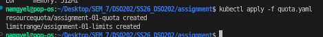

Used values sitting comfortably under the hard limits:

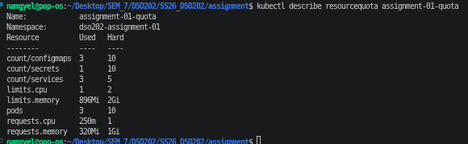

LimitRange details:

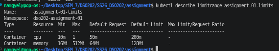

---

## Task 7: Verification and Interactivity

### a. Full CRUD cycle

A task was created directly through the browser once the frontend fix above was in place, and the full cycle was also run through curl against a port forwarded backend, which is the path the assignment explicitly allows as evidence.

Task created through curl:

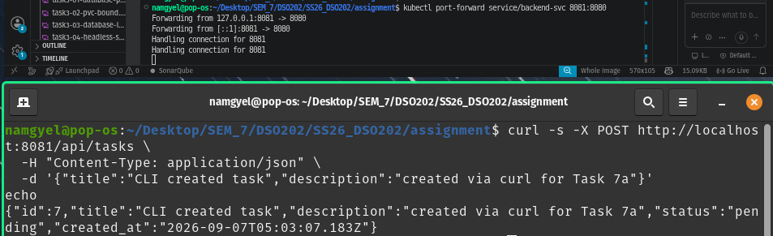

All tasks listed:

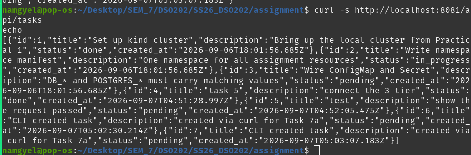

Task updated:

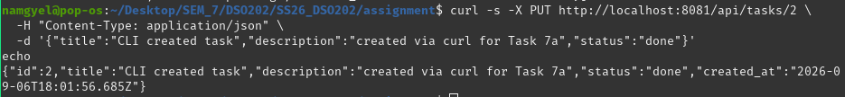

Task deleted:

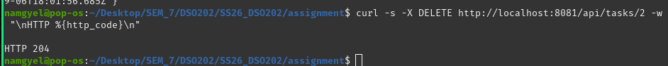

Confirming the deleted task is really gone:

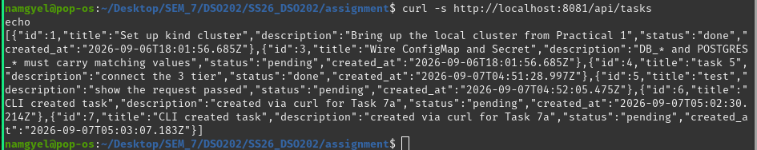

### b. Service DNS resolution

From inside the frontend Pod, the backend Service was reached by name using curl/wget, showing that cluster DNS resolves `backend-svc` correctly.

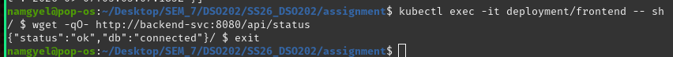

### c. Self healing and data persistence

A task was confirmed present in the database, then the backend Pod was deleted on purpose while watching `kubectl get pods --watch`. The Deployment's ReplicaSet noticed the Pod was missing and created a new one automatically, with no manual action needed.

Task present before deletion:

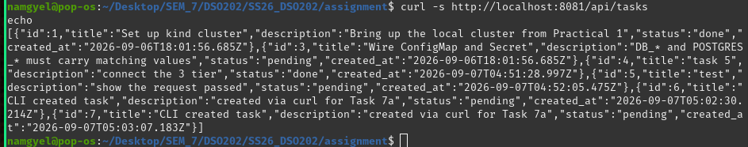

Pod being recreated, watched live:

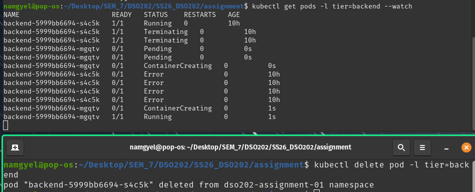

After the new backend Pod came up, the same task was still retrievable, proving that the Pod's lifecycle and the data's lifecycle are separate. The Pod that first created the task was gone, but the data lived on in Postgres, backed by the PVC:

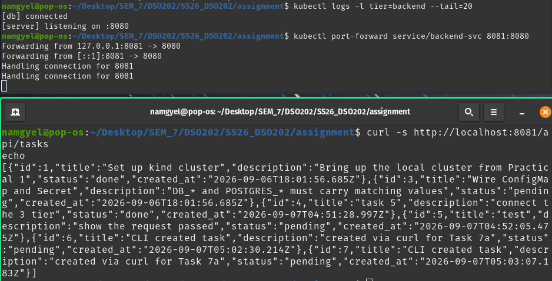

### d. Declarative vs imperative comparison

The namespace was used for this comparison, since it is the simplest object in the whole assignment.

Dry run of the imperative equivalent, without actually creating anything:

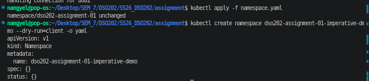

The imperative command actually run, then cleaned up straight after:

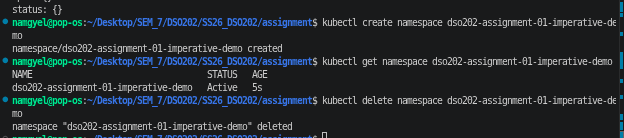

**Comparison.** Running `kubectl create namespace ...` creates the object immediately with one command and no file involved. It is quick for trying something out, but it leaves nothing behind that can be checked into version control, and running the same command twice on something that already exists just fails outright. Running `kubectl apply -f namespace.yaml` instead reads the desired state from a file that is already committed to the repository. Applying it again when nothing has changed just prints `unchanged`, and the whole namespace, along with everything else in this assignment, can be rebuilt from scratch just by reapplying the same files. That is exactly why every object in this assignment other than this one throwaway example was created the declarative way.

---

## Task 8 : Namespace RBAC

A ServiceAccount (`readonly-viewer`), a Role (`namespace-viewer`), and a RoleBinding (`readonly-viewer-binding`) were added, all scoped to `dso202-assignment-01` only. The Role only grants `get`, `list`, and `watch` on Pods, Services, ConfigMaps, Secrets, PersistentVolumeClaims, Deployments, and ReplicaSets. No write permissions such as `create`, `update`, or `delete` are given.

**Evidence**

Objects created:

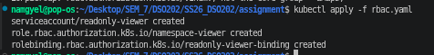

Allowed actions confirmed with `kubectl auth can-i`:

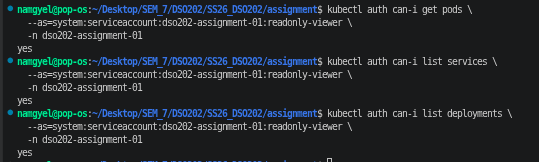

Denied actions confirmed, including a check against a different namespace which also returns no, showing that the permission really is limited to this one namespace and not accidentally cluster wide:

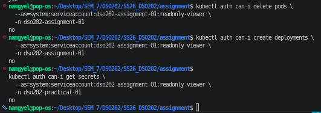

---

## Reflection

The biggest problem in this assignment was the container images being built for arm64 only, which meant none of the three tiers could start at first on this amd64 machine. This was found by reading the exact error from `kubectl describe pod`, then confirming the cause with `docker manifest inspect`. It was reported to the tutor and worked around using QEMU emulation together with `kind load docker-image`, so the assignment could still be completed while waiting for a fixed image.

The second problem, once all three tiers were running, was that the frontend could load in the browser but could not actually fetch any tasks, since it was trying to reach `backend-svc` directly from the browser, which does not work outside the cluster. This was solved by adding a small reverse proxy inside the frontend's nginx config through a second ConfigMap, without touching the original image, which also fixed a second smaller issue where the entrypoint script was quietly falling back to `localhost:8080` and clashing with an unrelated Jenkins server already running on that port on this machine.

Looking back, one thing that would help next time is checking the image architecture before starting any Deployment work at all, rather than finding out partway through Task 3. The one thing that is still not fully clear is whether the frontend's reverse proxy approach used here is the standard way this kind of problem is normally solved in real deployments, or whether there is a cleaner pattern that would normally be handled at the Ingress level instead, which is covered later in the module.

---

## References

Kind. (n.d.). *Quick start*. Kind Documentation. Retrieved September 7, 2026, from https://kind.sigs.k8s.io/docs/user/quick-start/
 
Kubernetes. (n.d.-a). *Kubernetes components*. Kubernetes Documentation. Retrieved September 7, 2026, from https://kubernetes.io/docs/concepts/overview/components/
 
Kubernetes. (n.d.-b). *Namespaces*. Kubernetes Documentation. Retrieved September 7, 2026, from https://kubernetes.io/docs/concepts/overview/working-with-objects/namespaces/
 
Kubernetes. (n.d.-c). *Resource quotas*. Kubernetes Documentation. Retrieved September 7, 2026, from https://kubernetes.io/docs/concepts/policy/resource-quotas/
 
Kubernetes. (n.d.-d). *Secrets*. Kubernetes Documentation. Retrieved September 7, 2026, from https://kubernetes.io/docs/concepts/configuration/secret/
 
Kubernetes. (n.d.-e). *Service*. Kubernetes Documentation. Retrieved September 7, 2026, from https://kubernetes.io/docs/concepts/services-networking/service/
 
Kubernetes. (n.d.-f). *Using RBAC authorization*. Kubernetes Documentation. Retrieved September 7, 2026, from https://kubernetes.io/docs/reference/access-authn-authz/rbac/
