# DSO202 Assignment 2 — Applying StatefulSets and Ingress to the Task Tracker

This assignment builds directly on the Assignment 1 three-tier Task Tracker deployment in this same
repository. Rather than a fresh deployment, this report covers two Unit II concepts applied on top of
the existing Assignment 1 work: converting the database tier from a Deployment to a StatefulSet, and
replacing the frontend's NodePort exposure with an Ingress. This folder (`assignment-2/`) is a record of
exactly what changed and what was added — it is not intended as a second, independently-deployable copy
of the application.

---

## Repository Structure

```
assignment-2/
├── README.md
├── ingress.yaml
├── database/
│   ├── statefulset.yaml       (new — replaces database/deployment.yaml + database/pvc.yaml from A1)
│   ├── deployment.yaml.old    (A1's original, kept for comparison)
│   └── pvc.yaml.old           (A1's original, kept for comparison)
├── frontend/
│   ├── service.yaml           (new — ClusterIP, replaces the A1 NodePort Service)
│   └── service.yaml.old       (A1's original NodePort version, kept for comparison)
└── evidence/
```

The live, working manifests (and the Assignment 1 originals under `legacy-a1/`) remain in
`assignment/`, unchanged in place except for the specific files this assignment modified. This folder
exists purely to show, in one place, what Assignment 2 actually added or changed relative to Assignment 1.

---

## Part 1: Database Tier — Deployment → StatefulSet

### Why this change was made

Unit II §2.1 introduces StatefulSets for workloads where replica identity, network address, and storage
must remain stable and predictable across rescheduling — properties a Deployment does not provide, since
Deployment replicas are treated as interchangeable. The database tier is the natural candidate for this
in the existing application, since it is the one tier where identity and storage genuinely matter.

### Why `replicas` stays at 1

The provided `sarojsanyasi/dso202-db` image is a plain single-node PostgreSQL image with no built-in
replication or leader-election logic. Setting `replicas` higher than 1 on a StatefulSet would produce
multiple **independent**, non-synchronised Postgres instances rather than a real cluster — which would be
incorrect, not merely incomplete. `replicas: 1` is therefore kept deliberately, and this StatefulSet is
used to demonstrate stable identity, `volumeClaimTemplates`, and ordered lifecycle management correctly,
rather than to fake multi-node replication the image cannot actually provide. A production multi-replica
setup would require either a replication-aware image or a dedicated Operator (e.g. CloudNativePG), which
encodes that operational knowledge in a custom controller — this is exactly the gap Unit II §2.4 describes
between a hand-written StatefulSet and a real database Operator.

### Migration approach

Before converting, a baseline of the existing tiers was captured to confirm everything was healthy prior
to any change.

**Evidence**

Cluster state before any Assignment 2 change:

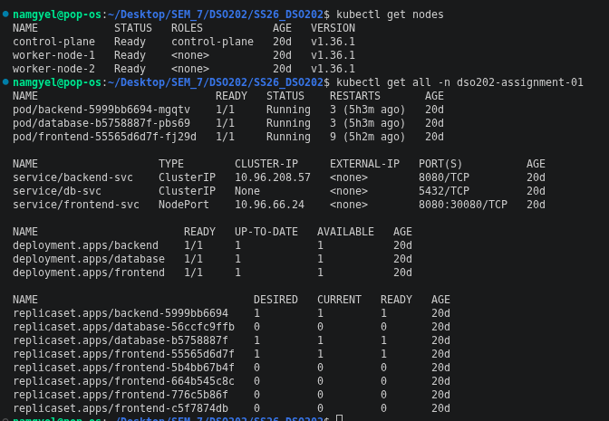

A marker task was created through the backend before touching the database tier, specifically to test
whether data would survive the coming migration:

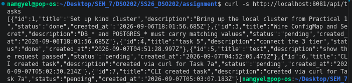

The old Deployment (`database`) was deleted first. Deleting a Deployment does not touch its PVC, so the
original `db-pvc` remained `Bound` immediately afterward:

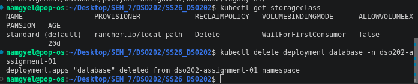

**Decision: the old PVC was discarded rather than migrated.** Kubernetes does not automatically rebind an
existing, independently-created PVC to a StatefulSet's `volumeClaimTemplates` naming convention
(`data-<statefulset-name>-<ordinal>`) — doing so would require manually renaming or relinking the
underlying PersistentVolume, which is fragile and not representative of how this mechanism is meant to be
used. The old `db-pvc` was deleted, and the StatefulSet was applied fresh, generating its own PVC
(`data-db-0`) from the template. This was a deliberate engineering call, not a shortcut: it produces
clean evidence of the StatefulSet's own persistence mechanism, rather than an ad hoc data transplant.

The StatefulSet manifest, `database/statefulset.yaml`, uses `serviceName: db-svc` (reusing the existing
headless Service from Assignment 1 unchanged), `volumeClaimTemplates` in place of a standalone PVC file,
and an explicit `persistentVolumeClaimRetentionPolicy` (`whenDeleted: Retain`, `whenScaled: Retain`) so
that PVC retention behaviour is stated outright rather than left to an implicit default.

Applying it created the StatefulSet successfully:

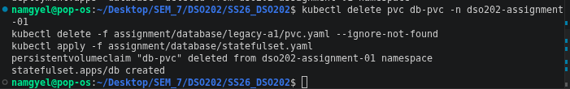

### Ordinal naming and auto-generated storage

The resulting Pod is named `db-0`, not a randomly-suffixed name — the ordinal naming StatefulSets
provide in place of a Deployment's arbitrary Pod names:

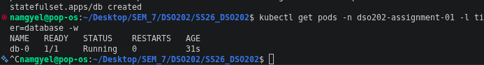

The PVC `data-db-0` was generated automatically from `volumeClaimTemplates`, with no separate `pvc.yaml`
required this time:

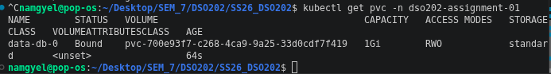

### Known issue: headless Service found no endpoints (label selector mismatch)

After the StatefulSet was applied, a DNS lookup against `db-0.db-svc.dso202-assignment-01.svc.cluster.local`
returned `NXDOMAIN`, and `kubectl get endpoints db-svc` showed `<none>`, even though `db-0` was `Running`.

**Diagnosis.** The headless Service `db-svc` (carried over unchanged from Assignment 1) selects Pods using
`selector: {app: database, tier: database}` — both labels are required for a match. The StatefulSet's Pod
template only carried `tier: database`, missing `app: database`. Since a Service selector requires every
key to match, `db-svc` matched zero Pods, so no DNS record was ever created for `db-0`, regardless of the
Pod itself being healthy.

**Fix.** Both `spec.selector.matchLabels` and `spec.template.metadata.labels` in the StatefulSet were
updated to include `app: database` alongside `tier: database`. Because `spec.selector` is an immutable
field on an existing StatefulSet (`kubectl apply` was rejected with
`Forbidden: spec.selector: Field is immutable`), the StatefulSet object itself had to be deleted and
recreated using `kubectl delete statefulset db --cascade=orphan`, which removes only the StatefulSet
object while leaving the running Pod and its PVC untouched, followed by re-applying the corrected
manifest. The StatefulSet then adopted the still-running `db-0` Pod — however, since that specific Pod
instance still carried only the old labels, it had to be deleted once more (`kubectl delete pod db-0`) so
that the StatefulSet would recreate it fresh with the corrected label set from the current template. The
underlying PVC was unaffected throughout, since Pod deletion and PVC lifecycle are independent — the same
property demonstrated deliberately in the next section.

Once `db-0` was recreated with both labels present, `db-svc`'s EndpointSlice correctly listed the Pod's
address, and DNS resolution succeeded:

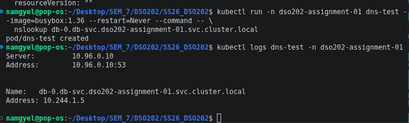

*(A secondary, unrelated hiccup surfaced while diagnosing this: a one-off diagnostic Pod
(`nslookup` via a throwaway `busybox` Pod) was briefly rejected with
`exceeded quota: assignment-01-quota, requested: limits.cpu=200m ... limited: limits.cpu=2`, since the
namespace's ResourceQuota from Assignment 1 Task 6 was already fully allocated to the three running
tiers. The quota's `limits.cpu` hard value was temporarily raised to `2200m` to allow the diagnostic Pod
to run, then reverted back to `2` immediately afterward once testing was complete — the quota values in
the live namespace are therefore unchanged from Assignment 1's justified figures.)*

### Persistence proven again under the StatefulSet

With DNS resolution fixed, a fresh marker task was created to specifically test persistence under the new
StatefulSet (the earlier marker task from before the migration was, by design, lost when the old PVC was
discarded — see the migration decision above):

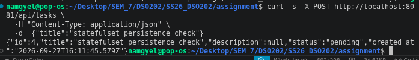

`db-0` was then deleted manually to trigger the StatefulSet's self-healing behaviour:

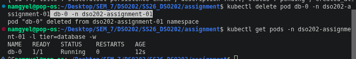

The new Pod came back with the **same name** (`db-0`) and reattached to the **same** PVC (`data-db-0`)
automatically. The marker task created moments earlier was still present afterward, confirming that Pod
lifecycle and data lifecycle remain independent under a StatefulSet, exactly as they did under the
Assignment 1 Deployment — but now demonstrated through the StatefulSet's own stable-identity mechanism
rather than a Deployment's PVC mount:

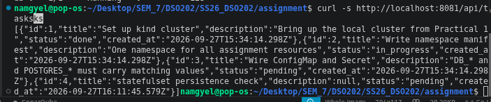

---

## Part 2: Frontend/Backend Exposure — NodePort → Ingress

### Why this change was made

Unit II §2.2 covers Ingress as the standard mechanism for routing external HTTP traffic to Services
inside a cluster through a single entry point, in place of one NodePort per application. Applying this to
the existing frontend also directly resolves the underlying cause of an Assignment 1 workaround: the
custom nginx reverse-proxy ConfigMap built in A1 existed specifically because a browser could not resolve
`backend-svc` directly. An Ingress with path-based routing solves the same problem at the correct layer.

### Checking Ingress readiness on the existing kind cluster

```
kubectl get node -o jsonpath='{.items[*].metadata.labels.ingress-ready}'
```

This returned empty output, confirming the kind cluster (set up in Practical 1 for the Assignment 1
NodePort mapping) was not provisioned with the `ingress-ready` port mappings an Ingress normally needs
for direct `localhost:80` access:

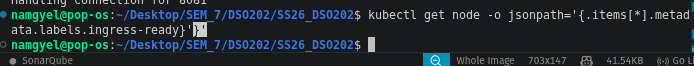

Rather than recreating the cluster (which would risk the node-local StatefulSet data just proven to
persist above), `kubectl port-forward` against the Ingress controller's own Service was used to reach it
for demonstration purposes — the same fallback pattern the Assignment 1 brief explicitly allowed for the
NodePort case.

### Installing the NGINX Ingress Controller

The kind-specific NGINX Ingress Controller manifest was applied:

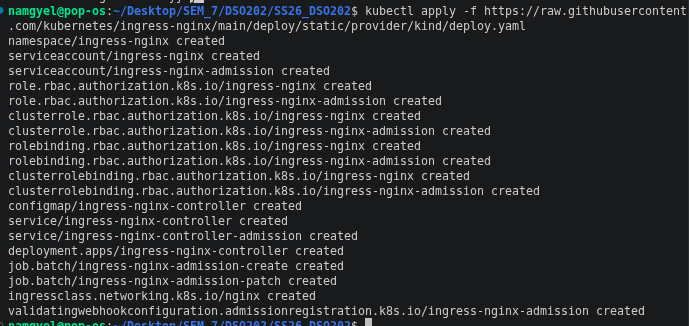

### Known issue: Ingress controller and admission Jobs stuck in `ContainerCreating`

All three Pods (`ingress-nginx-controller`, `ingress-nginx-admission-create`,
`ingress-nginx-admission-patch`) remained in `ContainerCreating` for several minutes with no error events
beyond a `Pulling image...` event that never resolved to either `Pulled` or `Failed`.

**Diagnosis.** `kubectl describe pod` on the controller showed it was blocked waiting on a Secret
(`ingress-nginx-admission`) that the `ingress-nginx-admission-create` Job is responsible for creating —
but that Job's own Pod was itself stuck mid-image-pull, so the Secret was never produced, and the
controller waited on it indefinitely. Checking the node directly (`docker exec dso202-worker crictl images`)
confirmed the `kube-webhook-certgen` image had not actually landed on the node, despite the "Pulling"
event having fired minutes earlier — the automatic pull had silently stalled at the containerd level.

**Fix.** The image was pulled manually and directly on the node:

```
docker exec dso202-worker crictl pull registry.k8s.io/ingress-nginx/kube-webhook-certgen:v1.6.9
```

This immediately unstuck the admission Jobs, which then completed and created the required Secret. The
same stalled-pull pattern then recurred for the much larger `ingress-nginx-controller` image itself, and
was resolved the same way:

```
docker exec dso202-worker crictl pull registry.k8s.io/ingress-nginx/controller:v1.15.1
```

Once both images were manually pulled, the controller Pod started successfully:

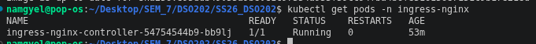

### ConfigMap check: `BACKEND_URL`

Before writing the Ingress rules, the live `BACKEND_URL` value was checked. It was found to already be an
empty string (`""`) — carried over from the Assignment 1 frontend fix, where `BACKEND_URL` was
deliberately set empty so the frontend would call a relative `/api/...` path rather than an
address a browser cannot resolve. This value is exactly what the Ingress setup also requires, so no
ConfigMap change was needed for this assignment. (Note: the ConfigMap's own source file still reflects
the original Assignment 1 value in its `last-applied-configuration` annotation, since the live value was
patched imperatively during A1's troubleshooting rather than through the file — this is a pre-existing
gap from Assignment 1, not something introduced here.)

### Retiring the NodePort Service

The frontend's Service was changed from `NodePort` to `ClusterIP`, since Ingress is now the sole external
entry point and no longer needs the frontend directly reachable on a node port. The original NodePort
manifest was preserved as `frontend/service.yaml.old` for comparison rather than deleted outright.

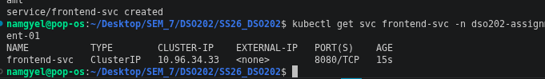

### Decision: `frontend-nginx-conf` was kept, not removed

The Assignment 1 reverse-proxy ConfigMap (`frontend-nginx-conf`) was reviewed to see whether it could now
be retired, since its `/api` proxy rule is made redundant by the Ingress routing `/api` directly to
`backend-svc`. However, inspecting the frontend Deployment showed this same ConfigMap also supplies a
corrected container entrypoint script, fixing an unrelated upstream bug in the original image where an
empty `BACKEND_URL` silently fell back to `http://localhost:8080` (which, on the development machine used
for Assignment 1, collided with a local Jenkins instance already running on that port). Since
`BACKEND_URL` is still deliberately empty under the Ingress setup, removing this ConfigMap would have
reintroduced that already-solved bug. It was therefore left in place unchanged — its proxy rule is simply
unused rather than actively harmful, and the entrypoint fix inside it is still required.

### Creating the Ingress

`ingress.yaml` was written with two path rules: `/api` → `backend-svc:8080`, `/` → `frontend-svc:8080`.

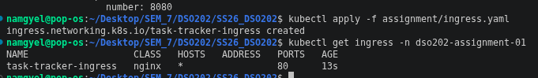

### Accessing the application through the Ingress

With the Ingress controller's own Service port-forwarded to the local machine
(`kubectl port-forward -n ingress-nginx svc/ingress-nginx-controller 8888:80`), the application was
reached at `http://localhost:8888/`, routed entirely through the Ingress rather than the old NodePort or
the Assignment 1 reverse-proxy workaround:

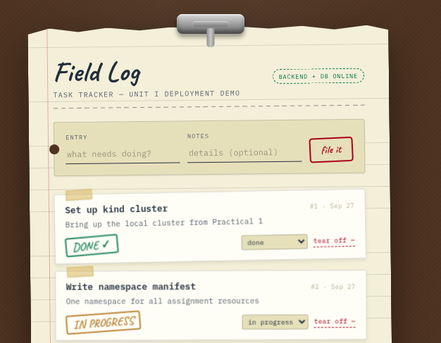

The backend's status endpoint, reached the same way, confirmed the full path was working end to end
(Ingress → `backend-svc` → backend Pod → database):

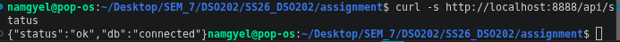

### Full CRUD cycle re-verified through the Ingress

A task was created, listed, updated, and deleted, all through `http://localhost:8888/api/tasks` rather
than a direct backend port-forward — demonstrating that the Ingress path supports the complete
application workflow, not just a single GET request:

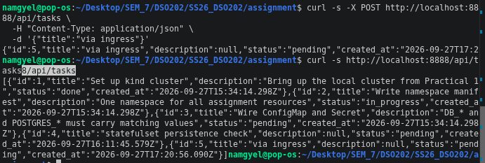
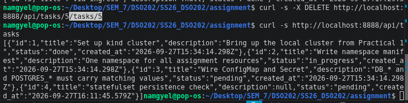

---

## Reflection

The database migration's biggest lesson was that a StatefulSet's label requirements are not automatically
inherited from whatever Deployment it replaces — the headless Service from Assignment 1 expected both
`app` and `tier` labels, and it took a genuinely empty `kubectl get endpoints` result, rather than any
error message, to reveal that the new StatefulSet's Pod template was one label short. This was a useful
reminder that a Pod reporting `Running` and `1/1 Ready` says nothing about whether a Service can actually
find it.

The Ingress setup's main obstacle had nothing to do with Ingress concepts themselves — it was a
containerd-level pull stall on this specific kind cluster, invisible to `kubectl describe` beyond a
`Pulling` event that never resolved, and only diagnosable by checking the node's own image cache directly
with `crictl`. This is a similar category of problem to the arm64 image issue from Assignment 1: a
platform-level snag that had nothing to do with the Kubernetes manifests being technically correct.

One open question, carried over from the original Assignment 1 reflection: whether a
production-appropriate way to fully retire `frontend-nginx-conf`'s `/api` proxy rule exists once Ingress
is in place, without also having to reimplement its entrypoint fix elsewhere — likely something to revisit
once templating or init-container patterns are covered later in the module.

---

## References

Kubernetes. (n.d.-a). *StatefulSets*. Kubernetes Documentation. Retrieved September 27, 2026, from
https://kubernetes.io/docs/concepts/workloads/controllers/statefulset/

Kubernetes. (n.d.-b). *Ingress*. Kubernetes Documentation. Retrieved September 27, 2026, from
https://kubernetes.io/docs/concepts/services-networking/ingress/

Kubernetes. (n.d.-c). *Ingress Controllers*. Kubernetes Documentation. Retrieved September 27, 2026, from
https://kubernetes.io/docs/concepts/services-networking/ingress-controllers/

ingress-nginx. (n.d.). *Installation guide — kind*. Retrieved September 27, 2026, from
https://kubernetes.github.io/ingress-nginx/deploy/#kind

Kind. (n.d.). *Ingress*. Kind Documentation. Retrieved September 27, 2026, from
https://kind.sigs.k8s.io/docs/user/ingress/