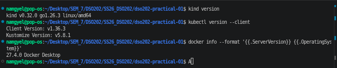
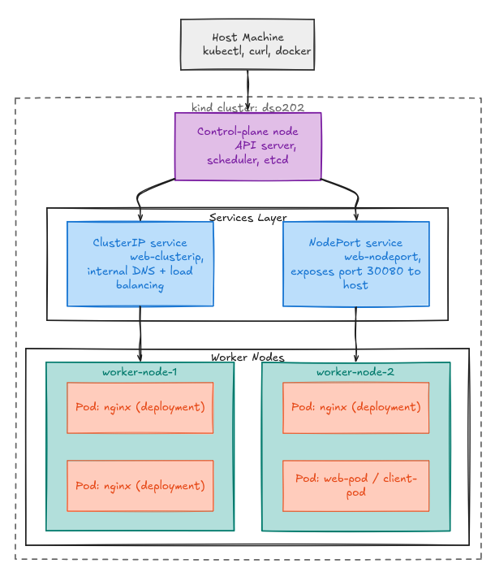

# DSO202 Practical 1 Report
## Local Kubernetes Cluster with kind

---

## 1. Objective

This practical sets up a local multi-node Kubernetes cluster using `kind` and uses it to explore the core building blocks of Kubernetes: namespaces, resource governance, pods, deployments, and services. All objects were managed declaratively using YAML manifests, and the whole environment was later destroyed and rebuilt to prove it is fully reproducible.

This report covers the following descriptor sections from the practical guide:
- Stage 1 — Cluster provisioning (3-node `kind` cluster)
- Stage 2 — Cluster inspection (nodes, kube-system pods)
- Stage 3 — Namespace, ResourceQuota, and LimitRange
- Stage 4 — Pods (imperative vs declarative, debugging tools)
- Stage 5 — Deployments (self-healing, scaling, rolling updates, rollback)
- Stage 6 — Services (ClusterIP, NodePort, LoadBalancer, readiness, misconfiguration)
- Stage 7 — Cleanup and reproducibility

---

## 2. Environment

### 2.1 Versions

| Component | Version |
|---|---|
| Operating System | Pop!_OS (Linux), Docker running via Docker Desktop |
| Docker | 27.4.0 |
| kind | v0.32.0 (go1.26.3, linux/amd64) |
| kubectl | v1.36.3 (Kustomize v5.8.1) |
| Cluster Kubernetes version | v1.36.1 |

Prerequisite check confirming Docker, kind, and kubectl are installed and reachable.

### 2.2 Architecture Overview

The diagram below shows the high-level architecture of the practical: a host machine issuing commands into a 3-node `kind` cluster, a control-plane node that schedules workloads, two services routing traffic in different ways, and two worker nodes each running application pods.

- **Host machine:** runs `kubectl`, `curl`, and `docker` outside the cluster to manage it and test connectivity.
- **Control-plane node:** runs the API server, scheduler, and etcd; every `kubectl` command and all pod scheduling decisions go through here.
- **ClusterIP service:** routes traffic internally within the cluster only, using DNS and load balancing across matching pods.
- **NodePort service:** does the same routing internally, but also exposes port `30080` so the host machine can reach the pods directly.
- **Worker nodes:** where the actual application pods run; the scheduler distributes pods across both workers rather than putting them all on one.

---

## 3. Procedure and Observations

### 3.1 Cluster Provisioning

**What was done:** A 3-node `kind` cluster (`dso202`) was created from a YAML config defining one control-plane node and two worker nodes, with a custom pod subnet, service subnet, and a NodePort mapping reserved for later use.

The 3-node cluster was created successfully and the kubectl context switched to it.

**What the output shows:** all three nodes came up and were registered under the `kind-dso202` context, confirming the cluster provisioned correctly on the first attempt.

### 3.2 Cluster Inspection

**What was done:** The cluster was inspected using `kubectl get nodes -o wide` and `kubectl get pods -n kube-system -o wide` to confirm node health and that core system components started correctly.

All three nodes are in the `Ready` state with the correct roles.

All core `kube-system` pods (CoreDNS, etcd, kube-proxy, etc.) are `Running`.

**What the output shows:** all nodes reached `Ready` status and every system pod (CoreDNS, etcd, kube-proxy, kindnet) is `1/1 Running`, meaning the cluster's control plane and networking layer are fully functional before any workloads are deployed.

### 3.3 Namespace, ResourceQuota, and LimitRange

**What was done:** A dedicated namespace (`dso202-practical-01`) was created, then a `ResourceQuota` (capping total CPU/memory/object counts) and a `LimitRange` (setting default container resource requests/limits) were applied declaratively.

The ResourceQuota shows current usage against the namespace's hard limits.

The LimitRange defines the default, minimum, and maximum resources for containers.

A pod created with no resource fields automatically received the LimitRange defaults.

**What the output shows:** a pod created with no resource fields at all was automatically assigned `requests: 50m/64Mi` and `limits: 200m/128Mi`, proving the LimitRange applies its defaults even when the pod author specifies nothing.

### 3.4 Pods — Imperative vs Declarative

**What was done:** A pod was first created imperatively (`kubectl run`) to observe how much Kubernetes fills in automatically. The same pod was then defined declaratively in `manifests/02-pod-web.yaml`, applied, and re-applied a second time. Debugging tools (`logs`, `exec`, `port-forward`) were tested against it.

The declarative `web-pod` is `Running`, and its Events section shows the scheduling timeline.

Label selectors were used to filter pods by `app`, `tier`, and custom labels.

An interactive shell inside the pod confirmed the container's hostname and nginx files.

Port-forwarding the pod to the host and curling it confirmed the app is reachable locally.

**What the output shows:** re-applying the same manifest a second time reported `unchanged` instead of making any change, proving declarative management is idempotent — it only acts when the live state actually differs from the manifest.

### 3.5 Deployments — Self-Healing and Scaling

**What was done:** A `Deployment` was applied with 3 replicas, creating a ReplicaSet that manages 3 pods. A pod was then deleted directly to test self-healing, and the deployment was scaled to 5 replicas before re-applying the original manifest.

The Deployment, its ReplicaSet, and all 3 pods report `3/3` ready.

After manually deleting a pod, the ReplicaSet automatically created a replacement.

**What the output shows:** deleting a pod caused the ReplicaSet to immediately create a replacement to restore the desired count of 3, and re-applying the manifest after a manual scale to 5 brought the count back down to 3 — proving the manifest is the source of truth over any manual change.

### 3.6 Rolling Updates and Failure Recovery

**What was done:** The deployment's image was updated to `nginx:1.31-alpine` under a `maxUnavailable: 0` rolling update strategy. As a deliberate failure test, the image was then set to a non-existent tag (`nginx:9.99-does-not-exist`), and the deployment was rolled back with `kubectl rollout undo`.

Rollout history lists each revision along with its recorded change-cause.

The rollout to a non-existent image tag left one pod in `ImagePullBackOff` while the 3 healthy pods stayed untouched.

After `rollout undo`, the deployment is back to `3/3` running the correct image.

**What the output shows:** because `maxUnavailable: 0` was set, the 3 original healthy pods were never removed even while the new pod failed to pull its image, and `kubectl rollout undo` successfully restored the deployment to `3/3` on the last working image.

### 3.7 Services — Discovery and Load Balancing

**What was done:** A `ClusterIP` Service (`web-clusterip`) was created in front of the deployment pods and `web-pod`. A separate `client-pod` (busybox) was used to test DNS resolution, HTTP access, and load balancing from inside the cluster.

The ClusterIP Service was created with an EndpointSlice pointing to the backend pods.

DNS lookup and an HTTP request from `client-pod` both succeeded through the Service.

Repeated requests through the Service were spread across all backend pods, proving load balancing.

**What the output shows:** `nslookup` correctly resolved the Service's ClusterIP, and 9 repeated requests through the Service were spread across all 4 backend pod endpoints, confirming the Service both provides stable DNS and load-balances traffic rather than sending every request to the same pod.

### 3.8 Readiness, Misconfiguration, and External Access

**What was done:** A pod's `index.html` was deleted to test readiness gating. A Service with a selector matching no pods was created to observe a broken EndpointSlice. A `NodePort` Service was tested from the host machine, and a `LoadBalancer` Service was created for comparison.

The pod stayed `1/1 Running` and the EndpointSlice was unchanged, since no readiness probe was defined.

A Service with a selector matching no pods produced an EndpointSlice with no addresses.

Curling `localhost:30080` from the host reached the pods through the NodePort Service.

A LoadBalancer Service stayed stuck at `<pending>` since kind has no cloud provider.

**What the output shows:** the readiness test did not change the EndpointSlice because the pod spec had no `readinessProbe` defined — Kubernetes only tracked container process state, not application health. The broken selector produced an EndpointSlice with `<unset>` addresses, the standard signature of a misconfigured Service. NodePort successfully exposed the pods to the host on port `30080`, while LoadBalancer stayed `<pending>` indefinitely because `kind` has no cloud provider to fulfil it.

### 3.9 Reproducibility

**What was done:** All workload objects (pod, deployment, both services, client pod) were deleted, then rebuilt with a single `kubectl apply -f manifests/` command. The cluster itself was then fully deleted.

A single `kubectl apply -f manifests/` command rebuilt every object from scratch.

The cluster was fully torn down, leaving no kind clusters behind.

**What the output shows:** every object was recreated correctly from the manifests directory in one command, and the cluster teardown left no residual `kind` clusters — proving the entire environment is captured in version control with no manual, undocumented setup steps.

---

## 4. Reflection

**What was difficult:** `[fill in — e.g. interpreting rollout status/progress deadline behaviour, or getting the readiness demo to behave as expected without a readinessProbe]`

**Error encountered:** During the rolling update test, setting the deployment's image to `nginx:9.99-does-not-exist` caused the rollout to stall. Repeated checks with `kubectl rollout status` returned `error: deployment "web-deployment" exceeded its progress deadline`.

The rollout status command reported the deployment had exceeded its progress deadline.

**Diagnosis:** `kubectl get pods -l app=web` showed one new pod, `web-deployment-ddd46bfd-mjfnj`, stuck in `Terminating`/`ImagePullBackOff` while the 3 original pods (`d26dd`, `fbrjw`, `kkgd9`) stayed healthy and `Running`. `kubectl get replicaset -l app=web` confirmed the old ReplicaSet still had `3/3` ready while the new one had `0` ready. This showed the cluster could not pull the image, but the `maxUnavailable: 0` setting was correctly preventing any healthy pod from being taken down in the meantime.

**Fix:** `kubectl rollout undo deployment/web-deployment` rolled the deployment back to the last working revision. `kubectl rollout status` then confirmed `deployment "web-deployment" successfully rolled out`, and `kubectl get deployment web-deployment -o jsonpath='{.spec.template.spec.containers[0].image}'` confirmed the image was back to `nginx:1.30-alpine`. A final `kubectl apply -f manifests/03-deployment-web.yaml` followed by `kubectl diff` printed `cluster matches manifest`, proving the live state was fully back in sync with the YAML file.

After rolling back, the pods, replicaset, image, and manifest all matched again.

**What would be done differently:** `[fill in — e.g. add a readinessProbe to the pod spec from the start so the readiness-gating demo in 3.8 would behave as expected, or run kubectl describe immediately after a stuck rollout instead of waiting]`

**Still unclear:** the exact interaction between `progressDeadlineSeconds` and `kubectl rollout status --timeout` — the deployment reported "exceeded its progress deadline" even before the manually specified `--timeout` value was reached in one case, and it would help to understand which of the two settings actually controls when Kubernetes marks a rollout as failed versus when the CLI simply stops waiting.

---

## 5. References

- Kubernetes Documentation — Deployments: `https://kubernetes.io/docs/concepts/workloads/controllers/deployment/` — accessed `[date]`
- Kubernetes Documentation — Service: `https://kubernetes.io/docs/concepts/services-networking/service/` — accessed `[date]`
- Kubernetes Documentation — Resource Quotas: `https://kubernetes.io/docs/concepts/policy/resource-quotas/` — accessed `[date]`
- Kubernetes Documentation — Limit Ranges: `https://kubernetes.io/docs/concepts/policy/limit-range/` — accessed `[date]`
- kind Documentation — Quick Start: `https://kind.sigs.k8s.io/docs/user/quick-start/` — accessed `[date]`
- kind Documentation — Configuration: `https://kind.sigs.k8s.io/docs/user/configuration/` — accessed `[date]`