# DSO202 Practical 1 Report
## Local Kubernetes Cluster with kind

## 1. Introduction

This practical sets up a local multi-node Kubernetes cluster using `kind` and uses it to explore the core building blocks of Kubernetes: namespaces, resource governance, pods, deployments, and services. All objects were managed declaratively using YAML manifests, and the whole environment was later destroyed and rebuilt to prove it is fully reproducible.

---

## 2. Cluster Provisioning

The cluster was created with one control-plane node and two worker nodes, using a custom pod subnet, service subnet, and a NodePort mapping for later use. All three nodes came up `Ready` and were labeled correctly (`worker-node-1`, `worker-node-2`).

The 3-node cluster was created successfully and the kubectl context switched to it.
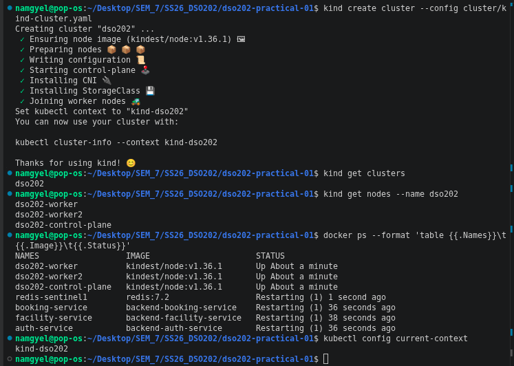

All three nodes are in the `Ready` state with the correct roles.
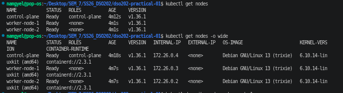

All core `kube-system` pods (CoreDNS, etcd, kube-proxy, etc.) are `Running`.
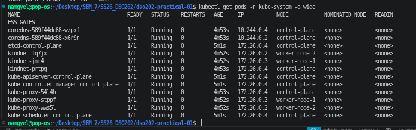

---

## 3. Namespace, ResourceQuota, and LimitRange

A dedicated namespace (`dso202-practical-01`) was created to isolate this practical's workloads. A `ResourceQuota` was applied to cap total CPU/memory/object counts in the namespace, and a `LimitRange` was applied so every container gets sensible default requests/limits even if none are specified.

This was proven by running a pod with no resources declared — Kubernetes automatically injected `requests: 50m/64Mi` and `limits: 200m/128Mi` from the LimitRange.

The ResourceQuota shows current usage against the namespace's hard limits.
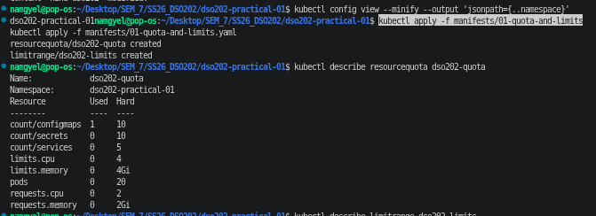

The LimitRange defines the default, minimum, and maximum resources for containers.
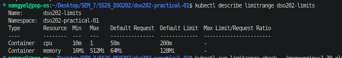

A pod created with no resource fields automatically received the LimitRange defaults.
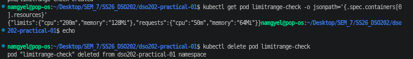

---

## 4. Pods — Imperative vs Declarative

A pod was first created imperatively (`kubectl run`) to see how much Kubernetes fills in automatically (status, node assignment, tolerations, resources). The same pod was then defined declaratively in `manifests/02-pod-web.yaml` and applied. Re-applying the same file a second time reported `unchanged`, showing that declarative management is idempotent — it only makes changes when something actually differs.

The pod was also used to test debugging tools: viewing logs, opening a shell with `exec`, and reaching it directly from the host with `port-forward`.

The declarative `web-pod` is `Running`, and its Events section shows the scheduling timeline.
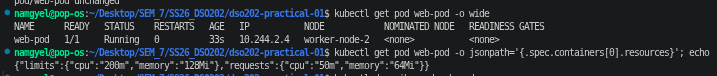

Label selectors were used to filter pods by `app`, `tier`, and custom labels.

An interactive shell inside the pod confirmed the container's hostname and nginx files.
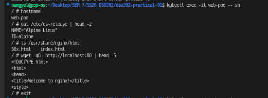

Port-forwarding the pod to the host and curling it confirmed the app is reachable locally.
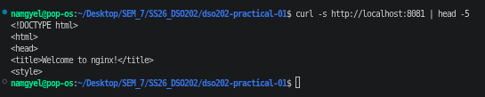

---

## 5. Deployments — Self-Healing and Scaling

A `Deployment` was applied with 3 replicas, which created a ReplicaSet that in turn created and manages the 3 pods.

**Self-healing:** deleting one of the pods directly caused the ReplicaSet to immediately create a replacement, keeping the replica count at 3.

**Scaling:** manually scaling to 5 replicas worked, but re-applying the original manifest brought it back down to 3 — showing that the manifest is the source of truth and always wins over manual changes.

The Deployment, its ReplicaSet, and all 3 pods report `3/3` ready.
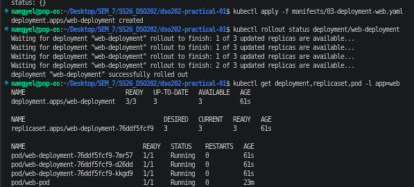

After manually deleting a pod, the ReplicaSet automatically created a replacement.
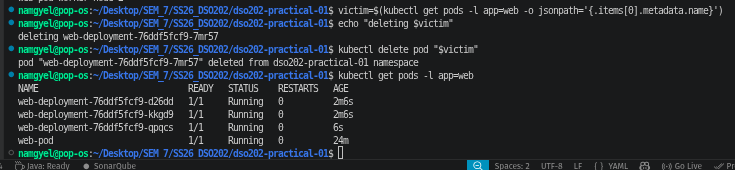

---

## 6. Rolling Updates and Failure Recovery

The deployment's image was updated to `nginx:1.31-alpine` using a rolling update strategy (`maxUnavailable: 0, maxSurge: 1`), meaning no pod is removed until its replacement is ready. This update reached its progress deadline slower than expected but eventually completed, and was recorded in rollout history with a change-cause annotation.

**Deliberate failure test:** the image was then changed to a tag that does not exist (`nginx:9.99-does-not-exist`). The rollout got stuck — one new pod went into `ImagePullBackOff` — but because `maxUnavailable: 0`, the 3 original healthy pods were never removed. The deployment was rolled back with `kubectl rollout undo`, which restored the working image and returned the deployment to `3/3 Running`. `kubectl diff` was used afterward to confirm the live cluster state matched the manifest file exactly.

Rollout history lists each revision along with its recorded change-cause.
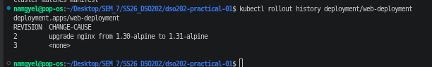

The rollout to a non-existent image tag left one pod in `ImagePullBackOff` while the 3 healthy pods stayed untouched.
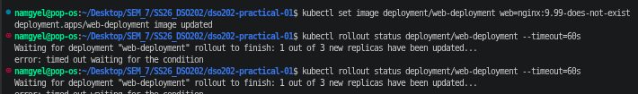

After `rollout undo`, the deployment is back to `3/3` running the correct image.
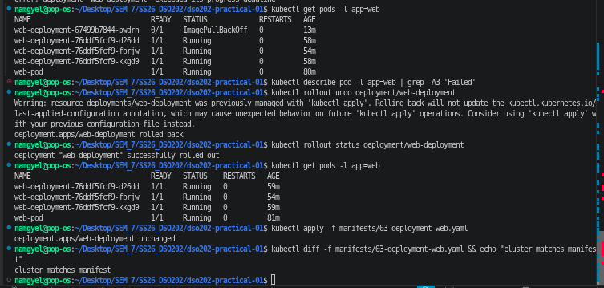

---

## 7. Services — Discovery and Load Balancing

A `ClusterIP` Service (`web-clusterip`) was created in front of the 3 deployment pods plus the standalone `web-pod`. A separate `client-pod` (busybox) was used to test it from inside the cluster.

- **DNS:** `nslookup web-clusterip` correctly resolved to the Service's ClusterIP.
- **HTTP:** `wget` through the Service returned the nginx welcome page.
- **Load balancing:** after giving each backend pod a unique response, 9 repeated requests through the Service were spread across all 4 pod endpoints, confirming the Service load-balances traffic rather than always hitting the same pod.

The ClusterIP Service was created with an EndpointSlice pointing to the backend pods.
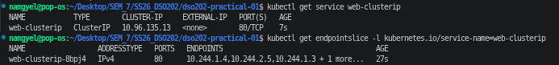

DNS lookup and an HTTP request from `client-pod` both succeeded through the Service.
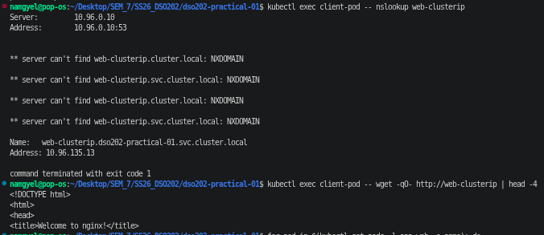

Repeated requests through the Service were spread across all backend pods, proving load balancing.
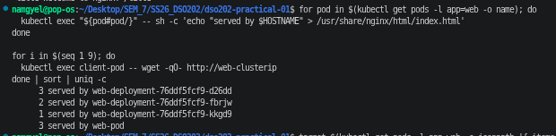

---

## 8. Readiness Behaviour

An attempt was made to simulate a pod going "not ready" by deleting its `index.html` file, expecting the EndpointSlice to drop that pod from routing. In this setup, the pod stayed `1/1 Running` and the EndpointSlice endpoint count did not change. This is expected once reviewed closely: the pod spec in this practical does not define a `readinessProbe`, so Kubernetes had no health check tied to the file's existence — it only tracks container process state, not application-level health. This is a useful distinction: a container can be "Running" while the application inside it is actually broken, unless a readiness probe is explicitly configured to catch that.

The pod stayed `1/1 Running` and the EndpointSlice was unchanged, since no readiness probe was defined.
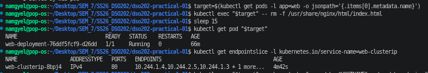

---

## 9. Misconfiguration and External Access

**Broken selector:** a Service was created with a selector that matched no pods. Its EndpointSlice showed `<unset>` addresses — this is the standard signature of a Service pointing at nothing, useful for diagnosing "Service exists but nothing responds" issues.

**NodePort:** `web-nodeport` exposed the same pods on port `30080` on the host machine. `curl http://localhost:30080` worked directly from outside the cluster, and repeated calls returned different pod names, confirming load balancing works the same way externally.

**LoadBalancer:** a `LoadBalancer` type Service was created for comparison. Its `EXTERNAL-IP` stayed `<pending>` indefinitely, because `kind` has no cloud provider integration to actually provision one.

A Service with a selector matching no pods produced an EndpointSlice with no addresses.
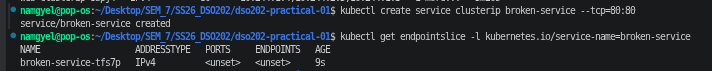

Curling `localhost:30080` from the host reached the pods through the NodePort Service.
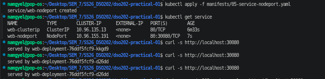

A LoadBalancer Service stayed stuck at `<pending>` since kind has no cloud provider.
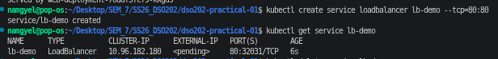

---

## 10. Reproducibility

All workload objects (pod, deployment, both services, client pod) were deleted, leaving the namespace empty. Running a single command, `kubectl apply -f manifests/`, recreated every object from the YAML files in the repository. This confirms the entire setup is captured in version control and does not depend on any manual, undocumented steps.

A single `kubectl apply -f manifests/` command rebuilt every object from scratch.
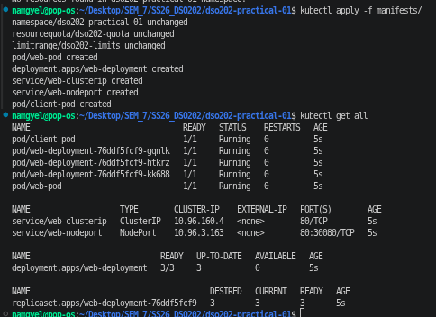

The cluster was fully torn down, leaving no kind clusters behind.
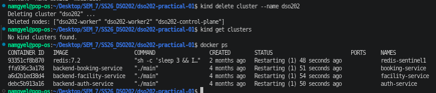

---

## 11. Reflection

**Error encountered:** During the rolling update test, setting the deployment's image to `nginx:9.99-does-not-exist` caused the rollout to stall. Repeated checks with `kubectl rollout status` returned `error: deployment "web-deployment" exceeded its progress deadline`.

The rollout status command reported the deployment had exceeded its progress deadline.
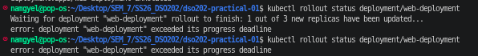

**Diagnosis:** `kubectl get pods -l app=web` showed one new pod, `web-deployment-ddd46bfd-mjfnj`, stuck in `Terminating`/`ImagePullBackOff` while the 3 original pods (`d26dd`, `fbrjw`, `kkgd9`) stayed healthy and `Running`. `kubectl get replicaset -l app=web` confirmed the old ReplicaSet still had `3/3` ready while the new one had `0` ready. This showed the cluster could not pull the image, but the `maxUnavailable: 0` setting was correctly preventing any healthy pod from being taken down in the meantime.

**Fix:** `kubectl rollout undo deployment/web-deployment` rolled the deployment back to the last working revision. `kubectl rollout status` then confirmed `deployment "web-deployment" successfully rolled out`, and `kubectl get deployment web-deployment -o jsonpath='{.spec.template.spec.containers[0].image}'` confirmed the image was back to `nginx:1.30-alpine`. A final `kubectl apply -f manifests/03-deployment-web.yaml` followed by `kubectl diff` printed `cluster matches manifest`, proving the live state was fully back in sync with the YAML file.

After rolling back, the pods, replicaset, image, and manifest all matched again.
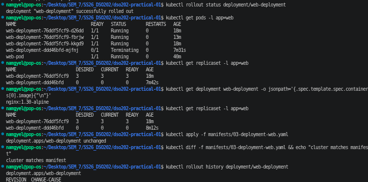

