# DSO202 Practical 2 Report
## Implementing Persistent Storage for a Stateful Application in Kubernetes

---

## 1. Objective

This practical focuses on how Kubernetes handles storage for workloads that need to keep data around, unlike the disposable Pods used in Practical 1. Two main areas are covered.

The first is the storage layer itself: PersistentVolumes, PersistentVolumeClaims and StorageClasses, and how they decide where data is written and what happens to it once a Pod, a claim, or a whole workload is removed.

The second is the StatefulSet controller, which is built for workloads where each replica needs its own identity and its own storage. A Deployment treats every replica as identical and replaceable, which works fine for a stateless web server but breaks down completely for a database.

By the end of the practical, a PostgreSQL database is deployed as a StatefulSet, a table is created and rows are inserted, the database Pod is deleted, and the rows are shown to still be there once the replacement Pod comes up. This maps to the descriptor's Unit I sections 1.2.5, 1.4.1, 1.4.2, 1.4.3 and 1.5.3, and Unit II sections 2.1.1 through 2.1.4.

---

## 2. Environment

| Item | Value |
|---|---|
| Operating system | Pop!_OS (Linux), using Docker Desktop |
| Docker | Docker Desktop, context `desktop-linux` |
| kind | v0.32.0 |
| kubectl | client version matching v1.35 to v1.37 range |
| Cluster Kubernetes version | v1.36.1 |
| PostgreSQL image | postgres:18-alpine |
| Node images | kindest/node:v1.36.1 |

One change was made from the setup described in the companion file. The host directory for static provisioning was meant to be `/tmp/dso202-p2-storage`, but Docker Desktop refused to mount it with a "Mounts denied" error, since `/tmp` was not in its list of shared paths. The host directory was moved to `~/dso202-p2-storage` instead (full path `/home/namgyel/dso202-p2-storage`), and the `hostPath` field in `cluster/kind-cluster.yaml` was updated to match. No other manifest needed changing.

---

## 3. Procedure and Observations

### Stage 0: Prerequisites and Verification
Docker, kind and kubectl versions were confirmed. Any leftover cluster from Practical 1 was removed. The host directory for static storage was created ahead of the cluster, at the adjusted path noted above.

### Stage 1: Cluster, Namespace and Storage Landscape
The cluster was created with `kind create cluster`. After the host path fix, this produced three nodes as expected.

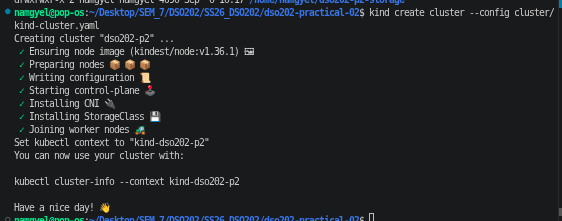

The Kubernetes node names matched the custom names set in the manifest, and were mapped to their Docker container names with `docker ps`. This confirmed the fallback cluster config was not needed.

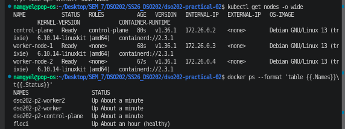

The namespace, quota, limit range and retaining StorageClass were applied. Describing the quota showed the storage limits sitting alongside the CPU and memory limits from Practical 1.

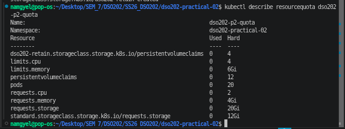

The two StorageClasses were listed to compare reclaim policy and binding mode, and the local-path provisioner Pod was located.

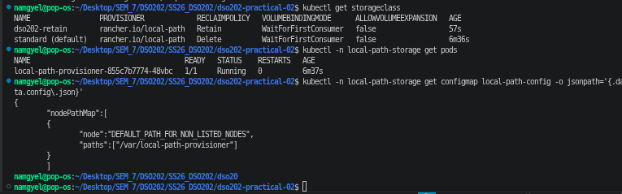

### Stage 2: Static Provisioning
A PersistentVolume was created by hand, pointing at a directory on worker-node-1. A PersistentVolumeClaim bound to it right away, since no provisioner or binding mode applies to a manually created volume. A Pod was started that appends a line to a file on the volume every time it starts.

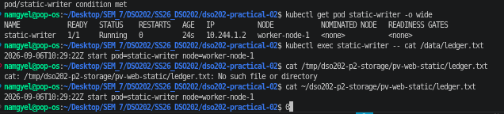

The Pod was deleted and recreated. The ledger file kept its earlier line and added a new one, showing the volume outlived the Pod.

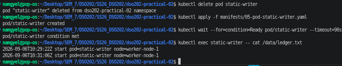

The claim was then deleted. Since the reclaim policy was Retain, the volume did not become available again, it moved into the Released phase instead, still showing the old claim in its status.

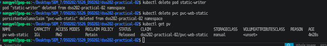

Deleting the PersistentVolume object itself did not remove the file on the host, proving that removing the Kubernetes object does not remove the actual data. Everything was recreated afterward, and the ledger file showed a third line.

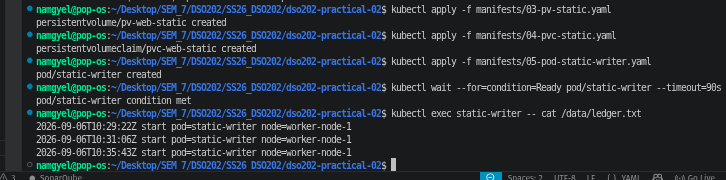

### Stage 3: Dynamic Provisioning
A claim naming the standard StorageClass was created with no Pod attached, and it stayed Pending. The event log explained why.

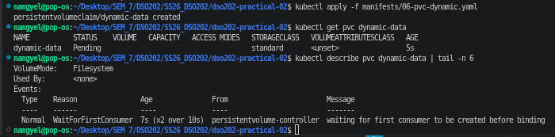

Once a Pod using the claim was created, the volume was provisioned on that Pod's node. Checking disk space inside the container showed the whole node's storage rather than the 1Gi requested.

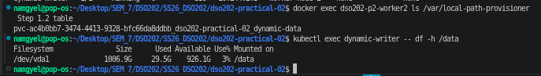

An attempt to grow the claim to 2Gi was rejected, since the StorageClass does not allow volume expansion.

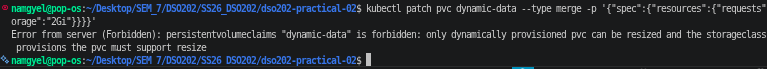

### Stage 4: Why a Deployment Cannot Own State
A Deployment with three replicas was pointed at a single shared claim, to see what goes wrong when a stateless controller is used for something that should not share storage.

All three replicas landed on the same node, even though nothing asked for that. The shared volume only exists on one node, so every Pod using it gets forced there.

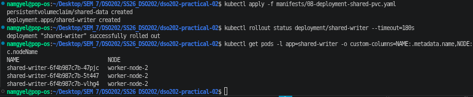

The file written by all three replicas turned out to be one shared log with entries from every replica mixed together, instead of three separate sets of data.

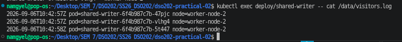

After deleting the Pods, the replacements came back with new, randomly generated names, showing a Deployment gives no lasting identity to its replicas.

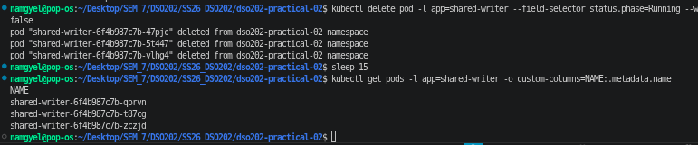

This stage is meant to fail in these three ways. That is exactly why StatefulSets exist for workloads like databases.

### Stage 5: StatefulSets and Stable Identity
A headless Service was created first, followed by the webnote StatefulSet. Pods were created one at a time, each ordinal only starting once the previous one was ready.

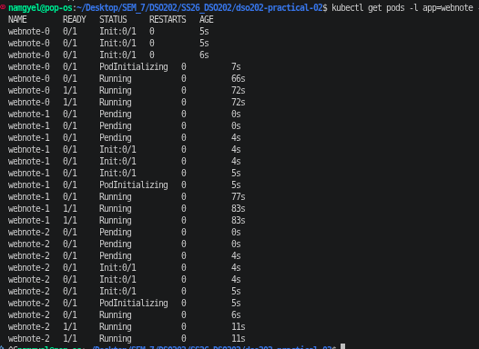

Each ordinal received its own separate claim instead of sharing one.

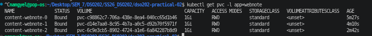

With each Pod owning its own volume, the Pods spread across different nodes instead of being forced onto one.

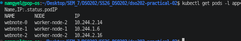

A client Pod was used to look up the StatefulSet's DNS names. The Service name resolved to all three Pod addresses, each carrying its own Pod's name.

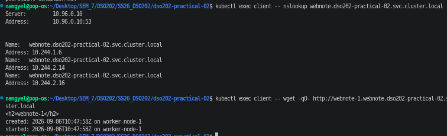

Writing a note into one Pod's file and checking both afterward confirmed each Pod had its own separate content.

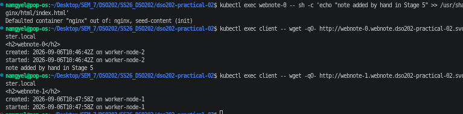

The middle Pod was deleted and allowed to come back. It kept the same name, reused the same claim, and still had its original file content from before deletion, plus a new line marking the restart.

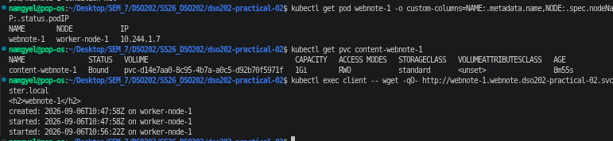

### Stage 6: Scaling, Retention and Ordered Updates
The StatefulSet was scaled up to four replicas, which created a fourth claim automatically, then scaled back down to two.

Watching the Pods during the scale down showed the highest numbered Pod finishing termination completely before the next one started, confirming Pods are removed in descending order, one at a time.

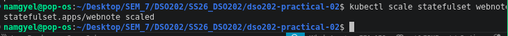
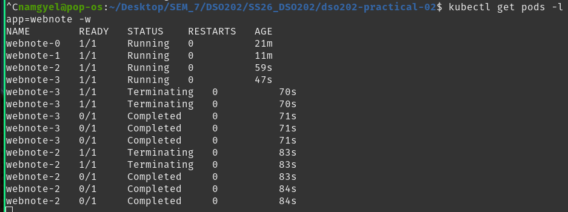

Even with two Pods gone, all four claims were still listed, since the scaling retention policy was set to keep them.

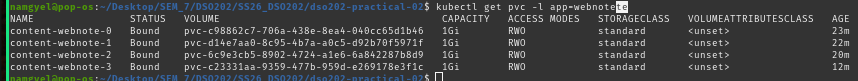

Scaling back up to three brought back the same claim for that ordinal. The file on it still had its original creation timestamp, meaning the same volume was reattached rather than a new one created.

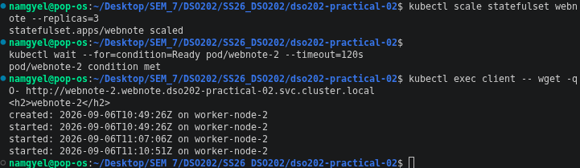

A partitioned rolling update was tested by editing the manifest directly, setting the partition value to two and changing the nginx image tag. Only the Pod with ordinal two or higher was updated, the others stayed on the old image.

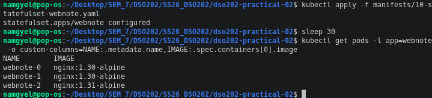

The partition was then set back to zero, completing the rollout in descending order. The StatefulSet was deleted and reapplied afterward, and the Pods came back with their original content intact.

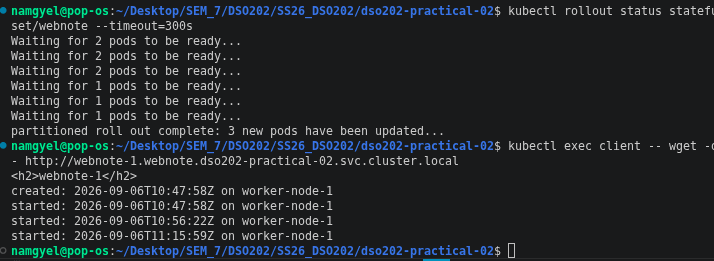

### Stage 7: A Real Stateful Application, PostgreSQL
Credentials were stored in a Secret, and two Services were created, one headless for individual Pod addressing and one regular ClusterIP Service for application connections. The PostgreSQL StatefulSet was deployed next.

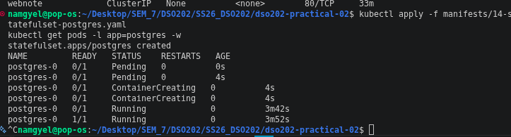

A table was created and a few rows were inserted using psql.

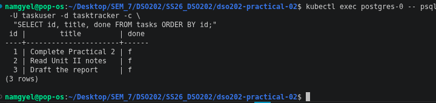

The database Pod was deleted on purpose. Once the replacement came up, the row count was checked again and matched.

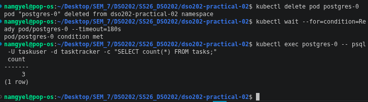

Both PostgreSQL Service names were checked with nslookup from the client Pod, confirming the connection string name and the per-Pod name both resolve.

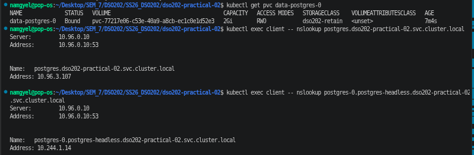

### Stage 8: Cleanup and the Cost of Retain
A full backup of the database was taken with pg_dump before removing anything, along with text dumps of the cluster's resources. The workloads were then deleted.

Checking the claims afterward showed six were still present, even though none were listed in the manifests just deleted, since claims generated from a template are never part of the applied file.

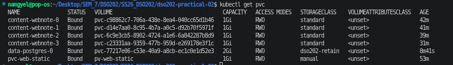

All claims were deleted next. The ones using the default StorageClass were removed completely, volume and all. The two using the retaining StorageClass moved into the Released state instead, keeping their data.

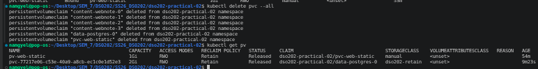

After deleting the cluster entirely, the host folder used for static storage was checked one last time. The file from Stage 2 was still there, since it lived on the host machine the whole time and was never actually inside the cluster.

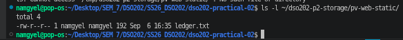

---

## 4. Analysis

**1. Why did the Stage 3 claim stay Pending while the Stage 2 claim bound right away?**

It comes down to the volumeBindingMode. The Stage 2 volume was made by hand with no real StorageClass behind it, so the claim matched it immediately based on capacity, access mode and class name. Stage 3 used the standard class, which uses WaitForFirstConsumer, so binding is delayed on purpose until a Pod that actually needs the claim gets scheduled. This way the volume ends up on the right node instead of possibly the wrong one.

**2. Which field decided that the Stage 2 data survived while the Stage 3 data did not, and who usually sets it?**

That is the reclaimPolicy field on the StorageClass, or directly on a hand made PersistentVolume. Stage 2's volume was set to Retain, so the data stayed when the claim was deleted. Stage 3 used the standard class, which is Delete, so the volume and its data disappeared the moment the claim was removed. This value is normally chosen by whoever manages the cluster's storage classes, not by whoever writes an individual claim.

**3. Why were all three Deployment replicas scheduled onto one node in Stage 4?**

The shared claim was bound to a volume that only exists on one node, and since every replica mounts that same claim, the scheduler had no other option but to put all three on that node. On a managed cloud cluster with a zonal disk, this usually fails outright instead, because a network disk can only attach to one node at a time, so any replica scheduled elsewhere would just get stuck.

**4. What is the full DNS name of the second webnote replica, and what needs to exist for it to resolve?**

Following the pod.service.namespace.svc.cluster.local pattern, it would be webnote-1.webnote.dso202-practical-02.svc.cluster.local. For that to resolve, the webnote-1 Pod has to exist and be ready, the headless Service named webnote has to exist with clusterIP set to None, and the StatefulSet's serviceName field has to point at that Service.

**5. What happened to the claims when the StatefulSet was scaled from four down to two and back to three?**

Scaling down to two did not delete the two extra claims, they just sat there unused. Scaling back up to three reused the existing claim for that ordinal rather than making a new one. This is controlled by persistentVolumeClaimRetentionPolicy, specifically the whenScaled field, which defaults to Retain.

**6. Why does the PostgreSQL manifest mount the volume at /var/lib/postgresql instead of the actual data directory?**

From PostgreSQL 18 onward the image keeps its data one folder deeper, inside a version numbered subfolder. Mounting at the parent folder means that version folder ends up inside the volume rather than being the mount point itself. If the volume were mounted straight onto the data directory and that directory already had something in it from the storage driver, initdb would refuse to start, since it will not initialise a folder that is not empty.

**7. Name two things a StatefulSet does not provide for a database.**

It does not replicate data, each replica gets its own separate volume with its own separate contents, so actual replication is left to the database software or to an Operator built for it. It also does not take backups, a volume surviving a restart is not the same thing as a backup stored outside the cluster, which is why a separate logical dump was taken in Stage 8.

**8. Why were two PersistentVolumes shown as Released instead of Available after Stage 8, and what needs to happen to reuse them?**

Both had a reclaim policy of Retain, so once their claims were deleted, Kubernetes would not just hand them to a new claim automatically, since that could give one workload's leftover data to a completely different workload. Reusing that storage needs an administrator to step in directly, either deleting the PersistentVolume object once the data is no longer needed or preparing it manually before it can bind again.

---

## 5. Reflection

The trickiest part of this practical was not the Kubernetes concepts, but getting the local setup to cooperate with them. Right at Stage 1, cluster creation failed with a Docker error saying the mount path was not shared, since Docker Desktop only allows bind mounts from paths it already knows about, and /tmp was not one of them. The fix was moving the host storage folder into the home directory instead, which Docker Desktop shares by default, and updating the hostPath value in the cluster config to match. This felt like the better option compared to changing Docker Desktop's file sharing settings, since a fix inside the repository's own config still works the same way on a different machine, while a manual settings change would not.

Another issue came up in Stage 6, while trying to capture the pod termination order during a scale down. The first two attempts missed it, because the watch command was only started after the scale down had already finished, so there was nothing left to catch. Kubectl's watch flag only streams events from the moment it starts. The fix was scaling back up to four replicas, starting the watch command first, and only then triggering the scale down from a separate terminal, which finally caught the pods terminating in the correct order.

A smaller issue also came up with kubectl wait right after a scale up, where it reported the pod as not found. This happened because the wait command ran before the API server had actually finished creating the pod object. Running the wait command again straight after fixed it.

If this practical were repeated, checking Docker Desktop's shared folder settings before starting would save some time. One thing that is still not fully clear is how much delay is normal between a kubectl command being accepted and the resulting object actually showing up, since that gap is what caused the wait command to fail early.

---

## 6. References

Docker Inc. (n.d.). *File sharing*. Docker Docs. Retrieved 2026, from https://docs.docker.com/desktop/settings-and-maintenance/settings/#file-sharing

Kubernetes Authors. (n.d.). *Persistent volumes*. Kubernetes Documentation. Retrieved 2026, from https://kubernetes.io/docs/concepts/storage/persistent-volumes/

Kubernetes Authors. (n.d.). *StatefulSets*. Kubernetes Documentation. Retrieved 2026, from https://kubernetes.io/docs/concepts/workloads/controllers/statefulset/

kind Authors. (n.d.). *Configuration*. kind Documentation. Retrieved 2026, from https://kind.sigs.k8s.io/docs/user/configuration/