# DSO202 Practical 5: Environment-Specific Configuration with Kustomize on Kind

| Field | Detail |
|---|---|
| Module | DSO202: Scaling, Orchestration, Monitoring & Observability |
| Programme | BE in Software Engineering |
| Practical | 5 |
| Tool | Kustomize (through `kubectl kustomize` and `kubectl -k`) on a kind cluster |
| Student | *[your name and enrolment number]* |

---

## 1. Objective

The aim of this practical was to deploy one small NGINX web application to three environments (dev, staging and prod) without keeping three copies of the same Deployment and Service. Copies drift apart as soon as one of them is edited and the others are forgotten. Kustomize avoids this by keeping the shared resources once in a base and describing only the differences in a thin overlay for each environment.

By the end of the practical I was able to:

- render a base and several overlays to plain Kubernetes YAML before touching the cluster;
- use the namespace, labels, replicas and configMapGenerator features of a `kustomization.yaml`, and change a Deployment with a strategic merge patch and a JSON 6902 patch;
- follow the safe workflow of render, diff, apply and verify;
- observe how a change in a generated ConfigMap changes its name, which changes the Deployment's pod template and triggers a rollout;
- read rendered output to find the cause of a Kustomize problem.

The practical covers the configuration management material in the two lesson notes on Kustomize concepts and on patches and generators. It also reuses the cluster, namespace and evidence habits from Practicals 1 and 2.

---

## 2. Environment

| Item | Value |
|---|---|
| Host operating system | Pop!_OS (Linux) |
| Docker | *[output of `docker info --format '{{.ServerVersion}}'`]* |
| kind | *[output of `kind version`]* |
| kubectl (client) | v1.36.3 |
| Kustomize (built into kubectl) | v5.8.1 |
| Kubernetes (cluster) | v1.36.1 |
| Node OS and runtime | Debian GNU/Linux 13 (trixie), containerd 2.3.1 |
| Cluster name and context | `dso202-p5`, `kind-dso202-p5` |
| Application image | `nginx:1.30-alpine` |

The cluster has one control-plane node and two workers, named `control-plane`, `worker-node-1` and `worker-node-2`. The names were set through the kubeadm configuration patches in `cluster/kind-cluster.yaml`, the same way as in Practical 1.

---

## 3. Procedure and Observations

### 3.1 Repository layout

The work is kept in one repository that follows the structure used in the earlier practicals.

```
dso202-practical-05/
├── README.md
├── cluster/
│   └── kind-cluster.yaml
├── examples/
│   └── webapp/
│       ├── base/        deployment.yaml, service.yaml, index.html, kustomization.yaml
│       └── overlays/
│           ├── dev/       kustomization.yaml, namespace.yaml, index.html
│           ├── staging/   kustomization.yaml, namespace.yaml, index.html
│           ├── prod/      kustomization.yaml, namespace.yaml, index.html, patch-resources.yaml
│           ├── qa/        kustomization.yaml, namespace.yaml, index.html, patch-annotation.yaml
│           └── sandbox/   kustomization.yaml (challenge extension, render only)
├── evidence/
└── image/
```

The practical did not supply the manifests, so I wrote the base and the overlays myself. The Deployment and Service exist only in `base/`. No overlay contains a copy of either file.

### 3.2 Task 0: Pre-flight

I ran `kubectl cluster-info`, `kubectl get nodes -o wide` and `kubectl version --client -o yaml` against the new cluster.

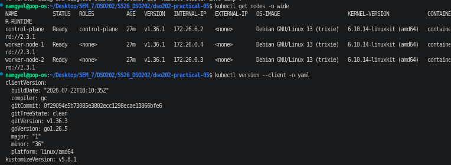

All three nodes report `Ready` at v1.36.1, and the client output contains `kustomizeVersion: v5.8.1`. This confirms that the context reaches the kind cluster and that `kubectl kustomize` and the `-k` flag are available.

### 3.3 Task 1: Reading the repository

I listed the tree before running anything.

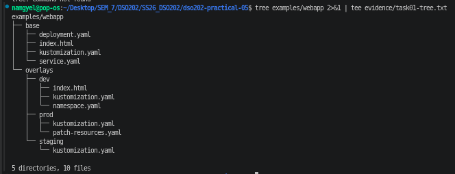

The tree shows one `base/` directory and one directory per environment under `overlays/`. The three questions from the task are answered as follows.

1. *Which files exist only once for all environments?* `deployment.yaml`, `service.yaml`, the default `index.html` and the base `kustomization.yaml`.
2. *Which values differ between environments?* The namespace, the replica count, the environment label, the page content and, for prod, the resource requests and limits.
3. *Where are the differences represented?* Only in each overlay: its `kustomization.yaml`, its `namespace.yaml`, its `index.html` and, for prod, `patch-resources.yaml`.

### 3.4 Task 2: Rendering the base

I rendered the base without applying it and filtered the output.

```bash
kubectl kustomize examples/webapp/base | grep '^kind:'
kubectl kustomize examples/webapp/base | grep 'name: web-content'
```

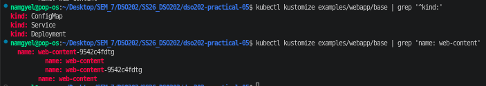

The output contains a ConfigMap, a Service and a Deployment. The `grep` returns four lines. Two of them carry the generated name `web-content-9542c4fdtg`: the ConfigMap's `metadata.name` and the `configMap.name` under the Deployment's `volumes`. The other two are plain `web-content`, which is the volume name and the mount name inside the Pod. Those two are local labels within the Pod specification and do not refer to another object, so Kustomize correctly left them alone.

The generated name is not exactly `web-content` because `configMapGenerator` appends a hash of the file content. Kustomize also rewrote the Deployment's reference to the hashed name, so I never had to write or calculate the hash myself.

### 3.5 Task 3: Comparing dev and prod without touching the cluster

I rendered both overlays to files and compared them.

```bash
kubectl kustomize examples/webapp/overlays/dev  > /tmp/webapp-dev.yaml
kubectl kustomize examples/webapp/overlays/prod > /tmp/webapp-prod.yaml
diff -u /tmp/webapp-dev.yaml /tmp/webapp-prod.yaml
```

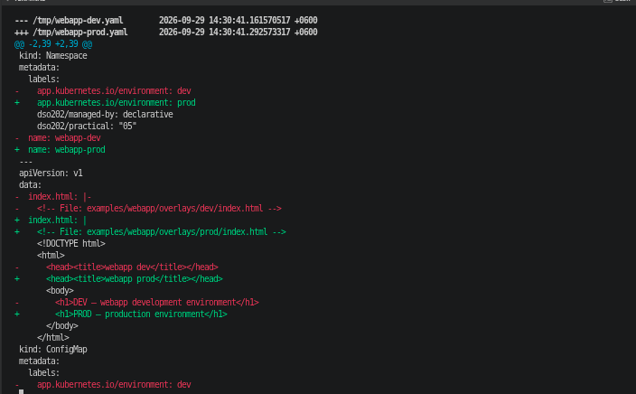

The diff shows the following differences, all of which come from a few lines in each overlay.

| # | Difference | Dev | Prod |
|---|---|---|---|
| 1 | Namespace | `webapp-dev` | `webapp-prod` |
| 2 | Environment label | `dev` | `prod` |
| 3 | Replicas | 1 | 4 |
| 4 | Resource requests | 25m CPU, 32Mi | 100m CPU, 64Mi |
| 5 | Resource limits | 100m CPU, 64Mi | 250m CPU, 128Mi |
| 6 | Page content | DEV heading | PROD heading |
| 7 | ConfigMap name | `web-content-8m26b62479` | `web-content-5ch65222dd` |
| 8 | Deployment's ConfigMap reference | follows the dev hash | follows the prod hash |

The image, ports, readiness probe, volume mount, selectors and the Service ports are identical in both renders. That is the point of an overlay: I can explain the whole environment difference by reading a short list, instead of reviewing two complete manifests.

### 3.6 Task 4: Deploying dev with render, diff, apply, verify

I rendered dev, then ran `kubectl diff -k`, then `kubectl apply -k`, and then checked the result.

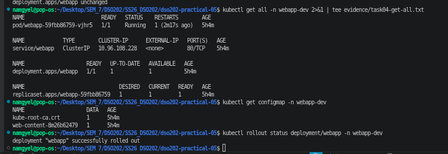

On the first run, `kubectl diff -k` returned `namespaces "webapp-dev" not found`. This is expected for a first deployment. The diff works by test-applying each object on the API server, and the namespace did not exist yet, so there was nothing to compare against. The apply then created the namespace, the ConfigMap `web-content-8m26b62479`, the Service and the Deployment. `kubectl rollout status` reported a successful rollout and `get all` shows one running pod, the `webapp` Service, the Deployment at 1/1 and one ReplicaSet.

The Deployment keeps the base name `webapp` in every environment. The namespace, not the name, separates one environment from another.

A note on the evidence: I applied dev again later while working through the tasks. The saved `task04-apply.txt` therefore shows `unchanged` for every object, and the pod age of about five hours in `get all` reflects the original deployment. The re-run also demonstrates that applying an unchanged kustomization is safe.

### 3.7 Task 5: Reaching the application

I used a port-forward to the Service. Port 8080 on my machine was already in use, and `kubectl port-forward` failed with `bind: address already in use`. I forwarded local port 9090 to the Service's port 80 instead.

```bash
kubectl port-forward -n webapp-dev service/webapp 9090:80
curl http://127.0.0.1:9090
```

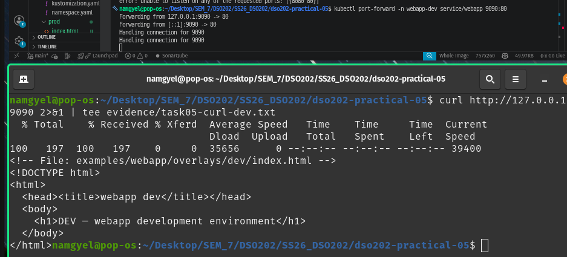

The response is the dev page, which identifies the development environment. This shows that the generated ConfigMap is mounted over NGINX's web root and that the dev overlay replaced the default page from the base.

### 3.8 Task 6: The ConfigMap hash and rollout chain

I recorded the ConfigMaps and pods, edited the heading in `overlays/dev/index.html`, rendered again, applied and recorded the state again.

| | Before the change | After the change |
|---|---|---|
| Generated ConfigMap | `web-content-8m26b62479` | `web-content-kf7g2h295b` |
| Deployment's volume reference | `web-content-8m26b62479` | `web-content-kf7g2h295b` |
| ReplicaSet | `webapp-59fbb86759` | `webapp-75476cbc45` |
| Pod | `webapp-59fbb86759-vjhr5` on `worker-node-1` | `webapp-75476cbc45-n5zg4` on `worker-node-2` |

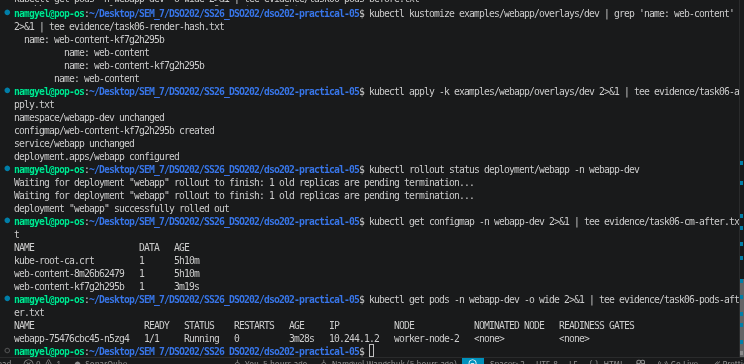

Rendering before the apply already showed the new hash `kf7g2h295b` in both places, so the change was visible without touching the cluster. The apply printed `configmap/web-content-kf7g2h295b created` and `deployment.apps/webapp configured`. The rollout status reported an old replica pending termination and then completed.

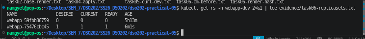

The ReplicaSet listing shows the rollout directly. The old ReplicaSet is scaled to 0 and the new one is at 1.

Two side observations. First, both `web-content-8m26b62479` and `web-content-kf7g2h295b` are listed after the apply, because `kubectl apply -k` does not prune old generated ConfigMaps. The old one stays until the namespace is deleted. Second, the new pod was scheduled onto a different worker. Nothing in the manifests chose a node, so the placement was made by the scheduler.

**The chain, in my own words**

```
file content changed
→ generated ConfigMap content changed
→ generated ConfigMap name hash changed
→ Deployment reference changed
→ Deployment pod template changed
→ rollout occurred
```

I edited `index.html`, so the data inside the generated ConfigMap was different. Kustomize builds the ConfigMap name from a hash of that data, so the new content produced a new name (`kf7g2h295b` instead of `8m26b62479`). The Deployment mounts the ConfigMap by name, and Kustomize rewrote that reference to the new name. The reference sits inside `spec.template`, so the pod template changed. A change to the pod template makes the Deployment controller create a new ReplicaSet (`webapp-75476cbc45`) and scale the old one (`webapp-59fbb86759`) to zero, which is a rolling update. Nobody had to restart anything by hand: the configuration change carried itself into a rollout.

### 3.9 Task 7: Deploying staging and prod

I ran diff and apply for staging and then for prod, and listed the Deployments and pods in all namespaces by label.

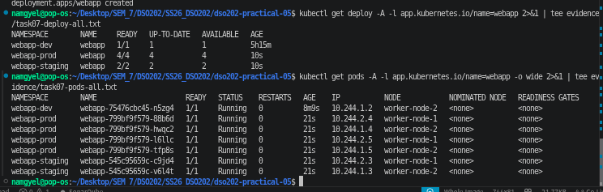

| Environment | Namespace | Replicas (ready) |
|---|---|---|
| dev | `webapp-dev` | 1 |
| staging | `webapp-staging` | 2 |
| prod | `webapp-prod` | 4 |

The pod listing showed the four prod pods split two and two between `worker-node-1` and `worker-node-2`, and the two staging pods placed one on each worker. As with dev, the same base produced all three environments, each with its own namespace and replica count.

### 3.10 Task 8: What the prod patch changed

I read `overlays/prod/patch-resources.yaml` and then looked at the rendered container resources.

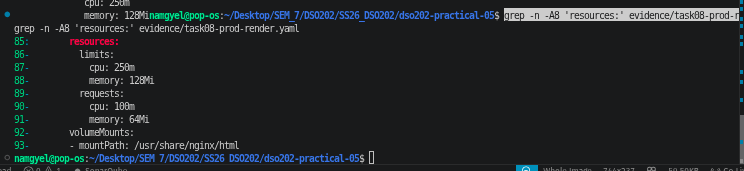

The rendered container has requests of 100m CPU and 64Mi memory and limits of 250m CPU and 128Mi memory. These are the prod values. The image, port, probe and volume mount from the base are still present in the render.

1. *Were the base values deleted or merged?* They were merged. The patch replaced the values it named and added the limits it named, while everything it did not mention was kept. Kustomize matched the container by its `name: webapp`.
2. *Which environment owns the production resource policy?* The prod overlay, in `patch-resources.yaml`. The base does not know about it.
3. *Why is a patch better than copying `deployment.yaml` into `prod/`?* A copy would repeat the whole Deployment, so any later change to the base (a new probe, a new image) would have to be made again by hand in every copy, and a forgotten copy becomes drift. The patch is about ten lines and inherits everything else from the base.

### 3.11 Task 9: The QA overlay

The QA overlay uses the same base and adds only what QA needs: namespace `webapp-qa`, two replicas, the environment label `qa`, its own `index.html`, and an annotation added by a JSON 6902 patch. Its four files are shown below.

`overlays/qa/kustomization.yaml`

```yaml
apiVersion: kustomize.config.k8s.io/v1beta1
kind: Kustomization

resources:
  - ../../base
  - namespace.yaml

namespace: webapp-qa

replicas:
  - name: webapp
    count: 2

labels:
  - pairs:
      app.kubernetes.io/environment: qa
    includeSelectors: false
    includeTemplates: true

configMapGenerator:
  - name: web-content
    behavior: replace
    files:
      - index.html

patches:
  - target:
      group: apps
      version: v1
      kind: Deployment
      name: webapp
    path: patch-annotation.yaml
```

`overlays/qa/patch-annotation.yaml`

```yaml
- op: add
  path: /metadata/annotations/training.example.com~1owner
  value: qa-team
```

`overlays/qa/namespace.yaml`

```yaml
apiVersion: v1
kind: Namespace
metadata:
  name: webapp-qa
  labels:
    dso202/practical: "05"
    dso202/managed-by: declarative
```

`overlays/qa/index.html`

```html
<!DOCTYPE html>
<html>
  <head><title>webapp qa</title></head>
  <body>
    <h1>QA environment (owner: qa-team)</h1>
  </body>
</html>
```

The annotation key `training.example.com/owner` contains a slash. In a JSON Pointer the slash separates path segments, so a slash inside a key has to be written as `~1`. The `add` operation also needs the parent map to exist, which is why the base Deployment declares an `annotations` map.

I rendered the overlay before applying it and checked that the annotation appeared.

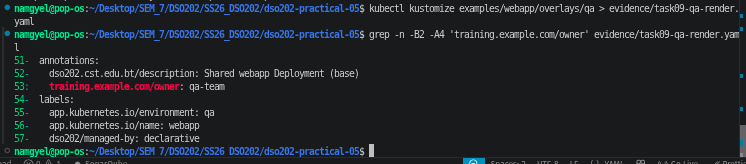

After the apply I read the live Deployment from the cluster.

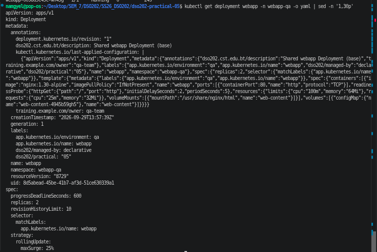

The live object carries `training.example.com/owner: qa-team`, two replicas, the namespace `webapp-qa` and the label `app.kubernetes.io/environment: qa`. The generated ConfigMap for QA is `web-content-4945b59gh5`, and both QA pods reached `1/1 Running`. Kubernetes and kubectl added further annotations of their own (`deployment.kubernetes.io/revision` and `kubectl.kubernetes.io/last-applied-configuration`), which are not part of my files.

### 3.12 Task 10: Cleanup

I deleted each environment with `kubectl delete -k` and checked for remaining namespaces.

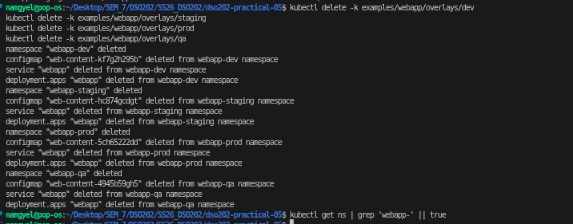

The check returns nothing, so the four namespaces were removed. Because each overlay includes its own `namespace.yaml`, deleting the kustomization also deleted the namespace, and with it the leftover ConfigMap from Task 6.

### 3.13 Challenge extension: reference-aware names

I created a `sandbox` overlay containing only `resources: ../../base` and `namePrefix: sandbox-`, and rendered it without applying it.

Predicted changes: the Deployment, the Service and the ConfigMap would gain the prefix, and the ConfigMap reference inside the Deployment would follow. Predicted to stay the same: the Service selector, the Deployment selector, the pod labels, and the volume and mount names.

Rendered result:

| Item | Result |
|---|---|
| Deployment | `sandbox-webapp` |
| Service | `sandbox-webapp` |
| ConfigMap | `sandbox-web-content-9542c4fdtg` |
| Deployment's `configMap.name` | `sandbox-web-content-9542c4fdtg` |
| Service selector | unchanged (`app.kubernetes.io/name: webapp`) |
| Volume and mount name | unchanged (`web-content`) |
| Container name | unchanged (`webapp`) |

The prediction matched the output. One thing I had not predicted is that the hash stayed at `9542c4fdtg`, the same value as the base render in Task 2. The hash is computed from the ConfigMap's content, and the prefix does not change the content. The main result is that Kustomize updated the Deployment's reference by itself when the ConfigMap was renamed, and left the selectors alone because they match labels rather than names.

---

## 4. Analysis

### 4.1 Strategic merge patch compared with JSON 6902

Both kinds of patch go under the `patches:` field, but they describe a change in different ways.

A strategic merge patch is a fragment written in the shape of the Kubernetes object. Kustomize finds the target by its kind and name and merges the fields I wrote into it. Lists such as `containers` are merged by the item's `name`, so my patch could change one container's resources without repeating the rest of the container. I used it for `overlays/prod/patch-resources.yaml`, where the change reads naturally as a piece of a Deployment.

A JSON 6902 patch is a list of operations (`add`, `replace`, `remove`), each acting on an exact path. The file has no `apiVersion`, `kind` or `name`, so the `kustomization.yaml` must give a `target` to say which object to change. I used it for `overlays/qa/patch-annotation.yaml`, which performs one `add` at one path. It is the better choice when the change is a single precise operation, such as removing one field, or when an exact position in a list matters. Its drawbacks are the escaping rule (`~1` for a slash in a key) and the fact that `add` fails if the parent path does not exist.

In short, a strategic merge patch speaks Kubernetes and a JSON 6902 patch speaks paths. The older fields `patchesStrategicMerge` and `patchesJson6902` are legacy syntax and I did not use them.

### 4.2 Answers to the concept questions

**Kustomize concepts**

1. *What belongs in a base?* The resources that are common to every environment: the Deployment, the Service and the generator for the default content.
2. *What belongs in an overlay?* Only what differs for one environment: namespace, replica count, labels, environment-specific content and patches.
3. *Does Kubernetes store the `kustomization.yaml` object?* No. It is a build instruction for Kustomize. The API server only receives the rendered Kubernetes resources.
4. *What does `kubectl kustomize DIR` do?* It builds the kustomization in that directory and prints the resulting YAML without contacting the cluster.
5. *What does `kubectl apply -k DIR` do?* It builds the same output and applies it to the cluster. The `-k` flag expects a directory that contains a kustomization, not a YAML file.
6. *Why is copying the whole Deployment into every environment a maintenance problem?* A common change must be repeated in every copy, and a missed copy causes configuration drift.
7. *Why inspect the rendered YAML before applying?* The rendered YAML is exactly what the cluster receives. A mistake in an overlay shows up there, as it did in my missing-file errors, before anything changes in the cluster.
8. *Why can `includeSelectors: true` be dangerous?* It would add the label to selectors as well. Deployment selectors are immutable after creation, and Service and NetworkPolicy selectors decide traffic routing, so a broad label change could break an existing workload. My overlays use `includeSelectors: false`.

**Patches and generators**

1. *Which field is used for both patch styles?* `patches:`.
2. *Which style is easier to read for container resources?* Strategic merge.
3. *Which style suits removing one exact path?* JSON 6902 with a `remove` operation.
4. *Why does a slash in an annotation key need `~1`?* Because `/` separates segments in a JSON Pointer, so a literal slash inside a key has to be escaped.
5. *What makes a generated ConfigMap name change?* A change in the content it is generated from.
6. *Why can a ConfigMap change cause a rollout?* The new name is written into the Deployment's pod template, and a template change makes the Deployment create a new ReplicaSet. Task 6 showed this.
7. *Why is a Secret not the same as encrypted secret management?* Secret data is only base64 encoded, which anyone with read access can decode. Real credentials should not be committed in plain text just because Kustomize can generate a Secret.
8. *Why is a long chain of patches a problem?* Patches are applied in order and can overwrite each other, so a reader would have to run the whole chain in their head to know the final state. A thin overlay with few patches is easier to review.

### 4.3 What the practical showed about the workflow

Working in the order render, diff, apply and verify gave me several places to catch errors before they reached the cluster. The render step caught all of my file mistakes, the diff step showed what would change, and the verify step confirmed the result. The habit of treating the rendered YAML as the source of truth was more useful than reading the overlay files alone.

---

## 5. Reflection

**What was difficult.** The hardest part was that the practical sheet described a repository that I did not have, so I had to write the base and all the overlays from the two lesson notes. This made me read the lessons closely, but it also meant that several of my early errors were simple omissions.

**A specific error and how I diagnosed it.** When I first ran `kubectl kustomize examples/webapp/overlays/prod`, the build failed with an error that ended in `lstat .../overlays/prod/namespace.yaml: no such file or directory`. The message named the exact file, and it came from the `resources:` list in `prod/kustomization.yaml`, which referred to a file I had not created. I created `namespace.yaml`, ran the render again, and got a second error, this time from the `configMapGenerator`: `loading KV pairs: file sources: [index.html]`, pointing at `prod/index.html`. Running `ls` on the prod and staging directories showed that prod had no `index.html` and that staging had neither `namespace.yaml` nor `index.html`. The reasoning was that every file named in a `kustomization.yaml`, whether under `resources:` or under a generator's `files:`, has to exist inside that overlay's directory. I created the three missing files and rendered dev, staging and prod again without errors. Both failures happened at the render step, so nothing wrong ever reached the cluster, which is the reason to render first.

**Other mistakes I made.**

- I saved the Task 3 diff with `diff ... || true 2>&1 | tee file`. The pipe attached to `true` and not to `diff`, so the evidence file was empty. I noticed it when the file had no content, and fixed it by redirecting with `diff ... > evidence/task03-diff.txt || true`. `wc -l` then showed 99 lines.
- I mistyped a filename as `task06-cm-before.txtxt` and renamed it with `mv`.
- `kubectl port-forward` on 8080 failed because the port was in use, and I used 9090.

**What I would do differently.** I would run `ls -R examples/webapp` and render every overlay straight after writing the files, before starting Task 3. That check would have found all three missing files in one pass. I would also add `--prune` or clean up old generated ConfigMaps if the environment were long-lived, because plain `apply -k` leaves them behind.

**What remains unclear.** I understand that `kubectl apply -k` leaves old hashed ConfigMaps in place, but I am not yet sure how pruning by label behaves for generated resources when several overlays share the same labels. I would like to test that in a follow-up.

---

## 6. References

1. Kubernetes Documentation. "Declarative Management of Kubernetes Objects Using Kustomize." https://kubernetes.io/docs/tasks/manage-kubernetes-objects/kustomization/ (accessed 30 September 2026).
2. Kubernetes SIGs. "Kustomize" documentation, including the `patches`, `configMapGenerator`, `namespace`, `labels` and `namePrefix` fields. https://kubectl.docs.kubernetes.io/references/kustomize/ (accessed 30 September 2026).
3. kind documentation. "Quick Start." https://kind.sigs.k8s.io/docs/user/quick-start/ (accessed 30 September 2026).
4. Bryan, P. and Nottingham, M. "JavaScript Object Notation (JSON) Patch." RFC 6902, IETF, 2013.
5. DSO202 course notes: "Kustomize: Concepts That Must Stick" and "Kustomize: Patches and Generators Deep Dive".
6. DSO202 Practicals 1 and 2 (repository structure, manifest comments, evidence conventions).